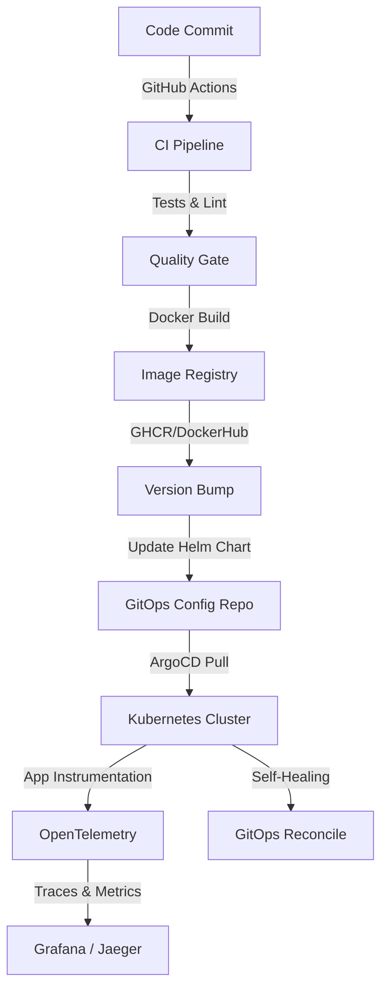

# 🚀 ENTERPRISE CI/CD FULL LIFECYCLE — Reservation Platform Case Study
### Ultimate DevOps Integration Guide | GitOps + Helm + OTel + CI

---

> **"A project is only as good as its delivery pipeline. We are building a self-healing, observable, and fully automated deployment engine."**
> — *Professor's Final Lecture*

---

## 🗺️ The Big Picture: Architecture

This guide integrates every skill you've learned in the **DevOps Skills** curriculum into a production-grade lifecycle for the **Reservation Platform**.

---

## 🛠️ The Stack (Free & Open Source)

| Component | Tool | Why? |
|---|---|---|
| **CI Engine** | GitHub Actions | Free for public repos, tightly integrated with Git. |
| **Package Management** | Helm | Industry standard for templating Kubernetes manifests. |
| **GitOps Operator** | ArgoCD | Declarative, version-controlled, and self-healing deployments. |
| **Observability** | OpenTelemetry | Vendor-neutral standard for traces, metrics, and logs. |
| **Infrastructure** | Kind / Minikube | Free local Kubernetes development. |
| **Backend** | Jaeger / Prometheus | Open-source observability backends. |

---

## 📋 Table of Contents

| Phase | Module Link | Topic |
|---|---|---|
| **Phase 1** | [Module 01: CI Setup](./Phase-01-CI-Pipeline/README.md) | Dockerizing & GitHub Actions |
| **Phase 2** | [Module 02: Helm Packaging](./Phase-02-Helm-Chart/README.md) | Creating the `reservation-platform` Chart |
| **Phase 3** | [Module 03: GitOps CD](./Phase-03-GitOps-CD/README.md) | ArgoCD Syncing & Version Automation |
| **Phase 4** | [Module 04: Observability](./Phase-04-Observability/README.md) | OpenTelemetry & Monitoring |

---

## 🚦 Phase 0: Prerequisites

Before you start, ensure you have:
1. A **GitHub Repository** for your source code (`reservation-platform`).
2. A **GitHub Repository** for your GitOps configurations (`reservation-platform-gitops`).
3. **Docker Desktop** installed.
4. **Kubectl**, **Helm**, and **ArgoCD CLI** installed (Refer to [GitOps Module 01](../GitOps-ArgoCD/README.md)).

---

## 🏁 Let's Begin

We will build this step-by-step. Each phase builds on the previous one.

### [Start Phase 1: The CI Pipeline →](./Phase-01-CI-Pipeline/README.md)
