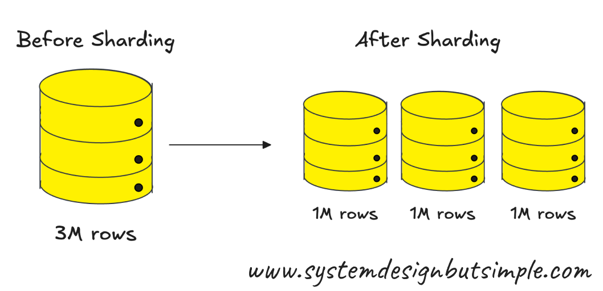
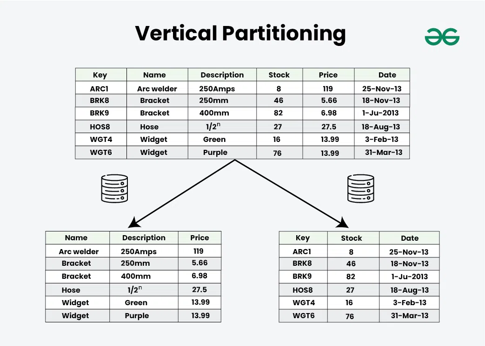

### Database Sharding
A technique that splits a large database into smaller parts (shards) to distribute data across multiple servers.
*Note*: Use it when a single database cannot handle the read/write load or data volume.

#### You need to know
- **Shard key**: Choosing the right shard key (e.g., user ID, region) affects data distribution and query efficiency. A bad choice can cause uneven load (a "hot shard").

- **Cross-shard** operations are costly: Joins, transactions, or queries across shards are complex and slow - design to avoid them.

- **Rebalancing** is hard: Moving data between shards when traffic grows unevenly or hardware changes is tricky and can require downtime or complex tooling.

### Partition Database
Def: là một phương pháp được sử dụng trong thiết kế hệ thống để chia nhỏ dữ liệu lớn thành các phần nhỏ hơn, dễ quản lý hơn.

#### Types of Data Partitioning

**Horizontal Partitioning**
Horizontal Partitioning, hay Sharding
Ưu điểm và nhược điểm
- Khả năng mở rộng, tốc độ truy vấn nhanh và giảm bớt áp lực lưu trữ trên một máy chủ đơn.
- Sharding cũng có nhược điểm là khó khăn trong việc quản lý và cần phải thiết kế cơ sở dữ liệu cẩn thận.

**Ví dụ thực tế**: Ví dụ về Horizontal Partitioning? Hãy tưởng tượng bạn đang quản lý một ứng dụng mạng xã hội lớn như Facebook. Với hàng trăm triệu người dùng, việc lưu trữ tất cả dữ liệu người dùng trên một máy chủ duy nhất là bất khả thi và không hiệu quả. Sharding giúp giải quyết vấn đề này bằng cách chia dữ liệu người dùng thành các phần nhỏ, mỗi phần được lưu trữ trên một máy chủ riêng biệt. Ví dụ, một phần vùng có thể chứa dữ liệu của người dùng ở Việt Nam, phần vùng khác chứa dữ liệu của người dùng ở Mỹ. Khi một người dùng muốn truy cập dữ liệu của họ, hệ thống chỉ cần tìm kiếm trong phần vùng tương ứng, giúp tăng tốc độ truy vấn và giảm áp lực lưu trữ trên từng máy chủ.

**Vertical Partitioning**

Def: Vertical Partitioning là phương pháp phân vùng dữ liệu theo chiều dọc. Nó chia dữ liệu thành các phần dựa trên cột, với mỗi phần vùng chứa một tập hợp con của cột dữ liệu. Vertical Partitioning giúp tăng hiệu suất truy vấn bằng cách giảm số lượng cột dữ liệu cần xử lý trong mỗi truy vấn.

Ưu điểm và nhược điểm
- Ưu điểm của Vertical Partitioning là khả năng giảm thiểu dữ liệu không cần thiết trong các truy vấn và tăng hiệu suất truy vấn. 
-  Tuy nhiên, nhược điểm của nó là việc quản lý phức tạp hơn và có thể gây ra vấn đề về tính nhất quán nếu không được quản lý cẩn thận.

**Ví dụ thực tế**: Ví dụ về Vertical Partitioning? Hãy nghĩ về một ứng dụng thương mại điện tử như Amazon. Khi một khách hàng truy cập trang sản phẩm, hệ thống không cần phải tải xuống tất cả thông tin sản phẩm từ cơ sở dữ liệu. Thay vào đó, nó chỉ cần tải các thông tin cần thiết như tên sản phẩm, giá, và hình ảnh. Các thông tin khác như mô tả chi tiết sản phẩm, đánh giá của kháchhàng, thông tin nhà sản xuất có thể được lưu trữ trong phần vùng khác và chỉ được tải khi cần thiết. Điều này giúp giảm lượng dữ liệu cần xử lý trong mỗi truy vấn và tăng tốc độ tải trang.

**Functional Partitioning**
Def: Functional Partitioning là phương pháp phân vùng dữ liệu dựa trên chức năng. Nó chia dữ liệu thành các phần dựa trên nghiệp vụ mà dữ liệu đó hỗ trợ. Mỗi phần vùng là một cơ sở dữ liệu độc lập, chứa dữ liệu cho một chức năng cụ thể của hệ thống.

**Ưu điểm và nhược điểm**
- Khả năng mở rộng, cung cấp khả năng tập trung vào cải thiện hiệu suất cho từng chức năng cụ thể.
- Khó khăn trong việc quản lý và duy trì tính nhất quán dữ liệu giữa các phần vùng.

**Ví dụ thực tế**: Ví dụ về Functional Partitioning? Hãy xem xét một hệ thống quản lý học sinh trường học. Hệ thống này có thể chia dữ liệu thành các phần vùng chức năng như: phần vùng dữ liệu học sinh, phần vùng dữ liệu giáo viên, phần vùng dữ liệu lớp học, và phần vùng dữ liệu điểm số. Mỗi phần vùng độc lập với nhau và được tối ưu hóa cho chức năng cụ thể của nó. Khi cần truy vấn dữ liệu, hệ thống chỉ cần tìm kiếm trong phần vùng chức năng tương ứng, giúp tăng hiệu suất và giảm độ trễ.

#### Cách chọn loại phân vùng dữ liệu phù hợp
- **Quy mô dữ liệu**: Đối với các hệ thống có quy mô dữ liệu lớn, Horizontal Partitioning hoặc Vertical Partitioning thường được sử dụng để tăng tốc độ truy vấn và giảm áp lực lưu trữ.
- **Tần suất truy vấn**: Nếu một số cột dữ liệu được truy vấn thường xuyên hơn những cột khác, Vertical Partitioning có thể là lựa chọn tốt để tăng hiệu suất truy vấn.
- **Yêu cầu về hiệu suất và khả năng mở rộng**: Functional Partitioning có thể giúp tối ưu hóa hiệu suất cho từng chức năng cụ thể và hỗ trợ tốt cho khả năng mở rộng hệ thống.
- **Nguồn lực hạ tầng và khả năng quản lý**: Việc phân vùng dữ liệu có thể tạo ra sự phức tạp về mặt quản lý và vận hành hệ thống. Hãy xem xét khả năng quản lý của đội ngũ kỹ thuật của bạn và nguồn lực hạ tầng hiện có.

