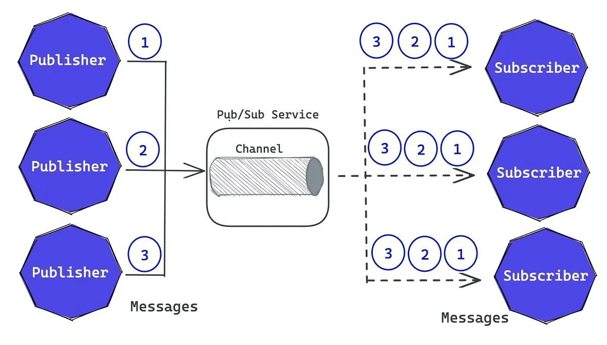
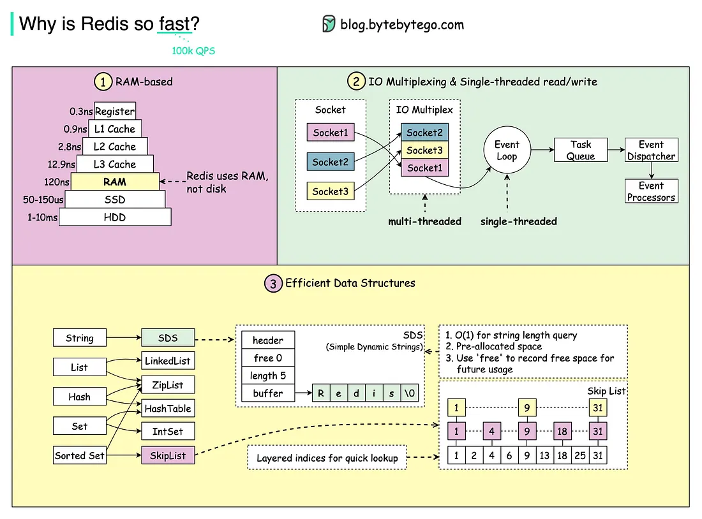
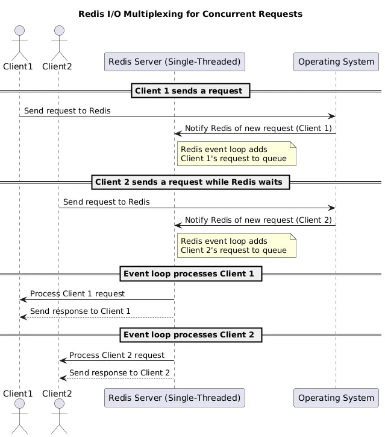
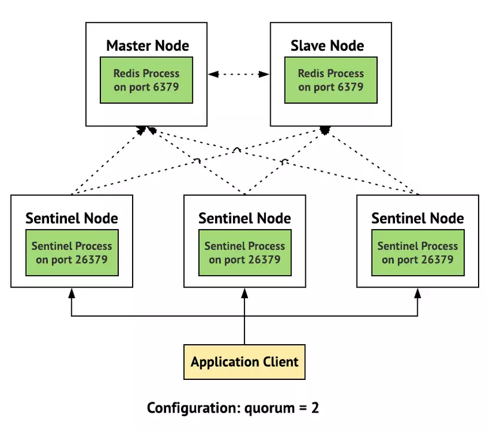
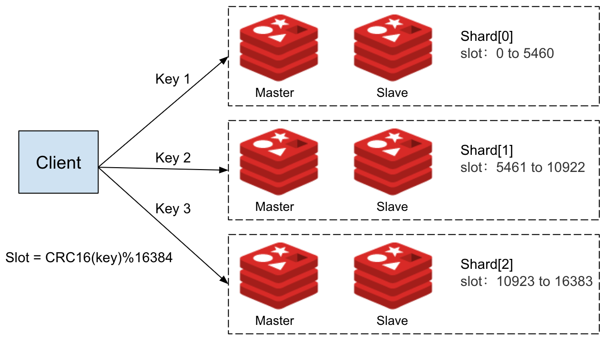
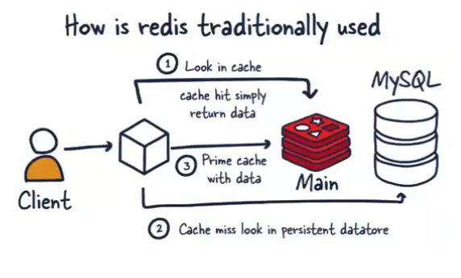

## Why use Redis?

Redis (**RE**mote **DI**ctionary **S**erver) is an open source, in-memory, NoSQL key/value store that is used primarily as an application cache or quick-response database.

**Benefits**

- One of the main advantages of using Redis for caching is its fast read and write speeds. Redis can handle millions of operations per second, which allows it to serve webpages faster than traditional databases.
- It also offers excellent support for transactions, allowing applications to perform multiple operations atomically. Additionally, Redis supports the use of pub/sub channels for fast data sharing between applications.
- Redis is also highly scalable and can be deployed across multiple machines for high availability
- Data Types: Redis supports a richer variety of data types including key-value pairs, lists, connections, and streams, allowing for more diverse use cases

**Drawbacks**

- It stores data entirely in memory, which means that it can be sensitive to data loss in the event of a crash or shutdown. To address this issue, Redis provides features such as persistence and replication. But this add complexity overhead
- Another drawback of Redis is that it is a single-threaded system, which means that it can only process one command at a time. This can limit the performance and scalability of Redis in applications that require high concurrency and parallelism. To address this issue, Redis provides clustering and sharding features that allow data to be distributed across multiple servers, but these features can be complex to set up and manage.

## What are the common data structures in Redis?

**Strings (Key-Value):**

- This is the most basic data structure, storing a simple mapping between a key and a string value.
- Common commands include GET and SET.
- ==Applications==: Dùng để lưu text, number, email or serialized objects. String can save up to 512MB, lý do là vì việc triển khai trong String là **SDS(String Dynamic Simple)** là một chuỗi có thể thay đổi tại runtime, và có cấu trúc/format đơn giản. SDS có vài loại mã hóa như sau
  - **Embedded String** chiếm 64 Bytes dung lượng và lưu <= 44 Bytes dữ liệu
  - **Raw String** lưu > 44 bytes
  - **int** ?? chắc là lưu string theo kiểu mã hóa URL64

**Hashes:**

- A hash is a map between fields and string values, ideal for representing objects.
- It allows direct modification of specific fields within an object.
- Common commands include GET and GETALL.
- Applications: storing user information (e.g., user ID, name, email as fields), or product details.

**Lists:**

- Lists are ordered collections of strings, functioning like doubled-linked lists.
- They are versatile and have many application scenarios.
- Common commands include LPUSH, RPUSH, LPOP, RPOP, and LRANGE.
- Applications: Implementing Facebook's follower/following lists or activity feeds (like Instagram's feed) where order matters.

**Sets:**

- Sets are unordered collections of unique strings.
- They are useful for storing distinct items and performing set operations.
- Common commands include SADD, SMEMBERS, and SUNION.
- Applications: Storing all followers for a user (e.g., on Instagram) or finding common interests between different groups by using set intersection operations.

**Sorted Sets (ZSETs):**

- Similar to Sets, but each member is associated with a score, which is a floating-point number. This score allows the elements to be ordered.
- Applications: Building leaderboards (e.g., gift rankings on Momo), managing delayed messages, or maintaining lists of online users ordered by their last activity

## How to set an expiration time for a key in Redis?

Redis provides mechanisms to automatically manage data lifecycle by setting expiration times for keys, which helps conserve memory resources by removing data that is no longer needed. Memory is a finite resource that cannot be expanded indefinitely, making efficient management crucial.

- **Expiration Mechanism**: Redis intelligently cleans its environment by deleting expired data. For example, a popular news article initially stored in Redis might be automatically deleted once its relevance fades after a few months.
- **Deletion Methods**:
  - **Periodic Deletion**: By default, Redis periodically selects a random subset of expired keys and deletes them, typically every 100 milliseconds.
  - **Lazy Deletion (Expiration upon Access)**: When a client attempts to access an expired key, Redis will delete it at that moment before returning an empty response.
  - **Manual/Scheduled Bulk Deletion**: The speaker suggests running a command to delete all expired keys during off-peak hours, such as 12 AM when user traffic is low, to avoid performance issues during peak times.
- **Criticality of Deletion Timing**: It's crucial to avoid deleting cached data during periods of high user traffic. If the cache is cleared when many users are active, their requests will be directed to the database, potentially overwhelming it and leading to system slowdowns or failures

## Transaction in Redis

Redis Transactions allow the execution of a group of commands in a single step, they are centered around the commands MULTI, EXEC, DISCARD and WATCH. Redis Transactions make two important guarantees:

- All the commands in a transaction are serialized and executed sequentially. A request sent by another client will never be served in the middle of the execution of a Redis Transaction. This guarantees that the commands are executed as a single isolated operation.

- The EXEC command triggers the execution of all the commands in the transaction, so if a client loses the connection to the server in the context of a transaction before calling the EXEC command none of the operations are performed, instead if the EXEC command is called, all the operations are performed. When using the append-only file Redis makes sure to use a single write(2) syscall to write the transaction on disk. However if the Redis server crashes or is killed by the system administrator in some hard way it is possible that only a partial number of operations are registered. Redis will detect this condition at restart, and will exit with an error. Using the redis-check-aof tool it is possible to fix the append only file that will remove the partial transaction so that the server can start again.

### Errors inside a transaction

- A command may fail to be queued, so there may be an error ==before calling EXEC==
- A command may fail ==after EXEC is called==. Errors happening after EXEC instead are not handled in a special way: all the other commands will be executed even if some command fails during the transaction.
  --> Starting with Redis 2.6.5, the server will detect an error during the accumulation of commands. It will then refuse to execute the transaction returning an error during EXEC, discarding the transaction.

### Rollback in Redis

- Redis does not support rollbacks of transactions since supporting rollbacks would have a significant impact on the simplicity and performance of Redis.

### Optimistic locking using check-and-set

- ==WATCH== is used to provide a check-and-set (CAS) behavior to Redis transactions.
- WATCHed keys are monitored in order to detect changes against them. If at least one watched key is modified before the EXEC command, the whole transaction aborts, and EXEC returns a Null reply to notify that the transaction failed.
- So what is WATCH really about? It is a command that will make the EXEC conditional: we are asking Redis to perform the transaction only if none of the WATCHed keys were modified

#### Summary

Transaction is a group of command that starts with "MULTI" command and ends with "EXEC" command
Transactions in Redis have the following properties

- Redis doesn't have rollback mechanism like other databases. And Redis solves this problem by WATCH command, it is like optimistic lock with version checking
- All commands in a transaction will be queued and performed sequentially
- During the process of performing a transaction if a command is failed to execute, other commands will be performed normally
- Command Queueing Error (before EXEC) ❌ Entire transaction is discarded. Redis refuses to run EXEC. Syntax error, wrong arity (e.g., SET key without a value).

### Redis Pipeline
- Pipeline hỗ trợ đóng gói nhiều command vào một câu lệnh duy nhất, giúp ta không cần gọi nhiều request liên tục nếu cần thực thi nhiều command
- Khác với transaction, pipeline không thực thi các command liên tục và cũng không chờ đợi các command trước đó hoàn thành thì mới gọi command tiếp theo 

----

## Redis Pub/sub

Khi một client **đã SUBSCRIBE** vào một hoặc nhiều channel, nó bước vào subscribed state, nghĩa là chỉ được phép gửi lệnh liên quan đến pub/sub (SUBSCRIBE, UNSUBSCRIBE, PSUBSCRIBE, PUNSUBSCRIBE...), cùng một số lệnh điều khiển như PING hoặc QUIT. Ngoài những lệnh này, client không được gửi các lệnh Redis khác (như SET, GET, ZADD...) nếu không dùng RESP3. The commands that are allowed in the context of a subscribed RESP2 client are:

- PING
- PSUBSCRIBE
- PUNSUBSCRIBE
- QUIT
- RESET
- SSUBSCRIBE
- SUBSCRIBE
- SUNSUBSCRIBE
- UNSUBSCRIBE

Redis' Pub/Sub exhibits **at-most-once message delivery semantics**. As the name suggests, it means that a message will be delivered once if at all. Once the message is sent by the Redis server, there's no chance of it being sent again.

If your application requires stronger delivery guarantees, you may want to learn about ==Redis Streams==. Messages in streams are persisted, and support both ==at-most-once as well as at-least-once== delivery semantics.

### Format of pushed messages

A message is an array-reply with three elements.

khi client thực hiện lệnh SUBSCRIBE hay UNSUBSCRIBE, Redis sẽ gửi thông điệp (message) đến client.

Những message này có dạng array (mảng) gồm các phần:

- Phần tử đầu là loại message (subscribe, unsubscribe, message, v.v.).
- Phần tử tiếp theo là tên channel.
- Phần tử cuối là số lượng channel hiện đang sub.

> **NOTE**: Pub & Sub trong Redis có phải là Message Queue hay không
> --> Câu trả lời là **không**. Bởi vì nó không có 1 cái tính năng thường được có trong một message queue, bởi vì trong message queue là 1 cái hàng đợi, queue phải có tính năng lưu trữ messages, đảm bảo bên kia có nhận được hay không, sắp xếp, lưu trữ message .Còn pub/sub thì cho phép nhiều client subscribe vào nhiều channels và nhận messages published lên các channels đó, và nó không có sự phân phối liên tục và đảm bảo khách hàng nhận được hay không (cơ chế at-most-once delivery)

> **Single-threaded Redis Speed: How I/O Multiplexing and In-Memory Storage Make Redis a Powerhouse**

### I/O Multiplexing -  Efficient Management of Concurrent Connections
Redis employs I/O multiplexing, is a technique that allows Redis to handle multiple client connections concurrently using a single thread. 
_Here is how it works_:
- **Non-Blocking I/O**: I/O multiplexing enables Redis to use non-blocking I/O. Rather than waiting for each client connection to complete before processing the next, Redis can move on to check other connections while waiting for data from one client.
- **Event Loop Management**: Redis continuously runs an event loop that processes client commands from the queue as soon as they are ready. This minimizes time wasted waiting for I/O operations, ensuring Redis can handle multiple concurrent requests without creating additional threads.

### Các cấu trúc dữ liệu hiệu quả
Vì Redis là cơ sở dữ liệu in-memory, nó có thể tận dụng một số cấu trúc dữ liệu bậc thấp hiệu quả mà không phải lo lắng làm sao để lưu chúng vào đĩa một cách hiệu quả. Danh sách liên kết, skip list, hash table là một số ví dụ.

## Cach Eviction
When redis uses max memory capacity at this time it uses something called "eviction policy" to discard some data
### Eviction Policy
- LRU (Least Recently Used)
- LFU (Least Frequently Used)
- Random
- Least TTL (Time To Live)
- Nonevict

## Cache Persistent
- Là một cơ chế cho phép redis lưu dữ liệu xuống disk để tránh tình trạng "Cold Start", là 1 trạng thái khi Redis server khởi động và không có gì trong RAM cả

## Redis Replication

### Redis Master-slave architecture
Các hệ thống lớn thường dùng replication để đảm bảo performance, durability, thay vì lưu trên disk để backup (persistent on)
- There is one node called master, and responsible for write operations
- Other nodes are slave(replica) nodes, and responsible mainly for read operations (master node can perform read operations too). Data from master node is synchronized to slave nodes by a separate protocol based on asynchronous mechanism.
- When a node is not available, so other nodes have backup, the cached data in which every node has, even when the master node dies, one replica node can replace it.

## Scalability
- Để có thể scale 1 hệ thống redis, chúng ta sẽ sử dụng nhiều node redis như là redis cluster.
- Redis cluster can be implemented by replication, culster mode, sentinel, ...
- However, in real-world projects, system will let developers use redis as one node for simplicity (the management of cluster will be performed by devOps team, or cloud service like **AWS/elastic cache/**, **Azure/azure cache/**)

### Redis Sentinel
- Thường được cài đặt cùng với cụm Redis Replicaiton để bổ sung khả năng **Fail-over** hay tăng khả năng **High Availability** cho Redis
- Redis Sentinel dùng để giám sát các node trong cụm Redis

- Like the above image, sentinel nodes are monitoring master and slave node and then these nodes will log out information like restart, stop, start
> **_So What is this information used for?_**
- This information is used in case "Fail-over" (Chuyển đổi dự phòng). Nếu như trước đây bạn chỉ cài đặt lên cụm replication thì khi node Master có vấn đề (down) thì bạn sẽ phải login vào server, khắc phục thủ công bằng tay bằng cách nâng 1 con slave bất kỳ lên làm Master . Tuy nhiên khi sử dụng Sentinel thì service này sẽ giúp bạn tự động hóa việc này.
- Sau 1 khoảng thời gian nhất định khi Sentinel không thể kết nối với Master node bằng cách gửi command PING đi mà không nhận được về PONG thì sẽ đánh dấu Node này đã bị down. Tiếp theo để đảm bảo tính chính xác, node này sẽ hỏi các node Sentinel khác rằng "ê mày có thấy thằng Master này down không?" . Nếu 1 số node nhất định cùng đồng ý rằng thằng Master này down (số node cần được xác định bằng thông số quorum trong config với công thức **số node sentinel/2 + 1** tương đương hơn 1 nửa) thì các node Sentinel sẽ cùng nhau bầu ra 1 Master mới. Còn nếu số node không đủ như yêu cầu thì quá trình bầu ra Master mới sẽ bị hoãn.
> **_So which node is eligible to be a master node ?_**
- We choose master node based on these criteria
    - slave-priority is configured on /etc/redis/redis.conf
    - If this priority is not present, sentinal will automatically generate an ID and node has the lowest ID will be a master

### Redis Cluster
- In this architecture there are more than one master nodes, and each master node will have their slave nodes. Salve nodes will communicate through specific protocol to get data from master node. Master nodes know the total number of current master nodes
- Each master-slave cluster will hold a shard of data. Based on shard of data corresponding master-slave cluster will respond 
- In this architecture data is sharded (horizontal partitioning)

### USE CASE 1: Cache from another database
Khi trong một hệ thống operations của db rất chậm, và quá nhiều request tương tự nhau được thực hiện nhiều lần (benchmark and monitor để đo)

- Use command set/get

Dữ liệu của Redis sẽ được đồng bộ với dữ liệu của database
- Ghi dữ liệu từ db ngay sau khi dữ liệu không tồn tại trên redis(2), cách này có thể làm cho dữ liệu get ra không phải là latest, cần set TTL của key với thời gian phù hợp
- Dùng một process riêng để đồng bộ từ db tới Redis, cách này sẽ đảm bảo dữ liệu không quá outdate so với bản gốc, tuy nhiên yêu cầu redis cần có memory lớn (or cần lựa chọn hot key để lưu), hoặc sẽ không phù hợp nếu db change quá nhiều.

