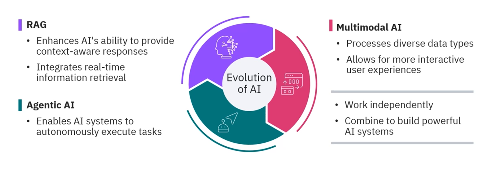
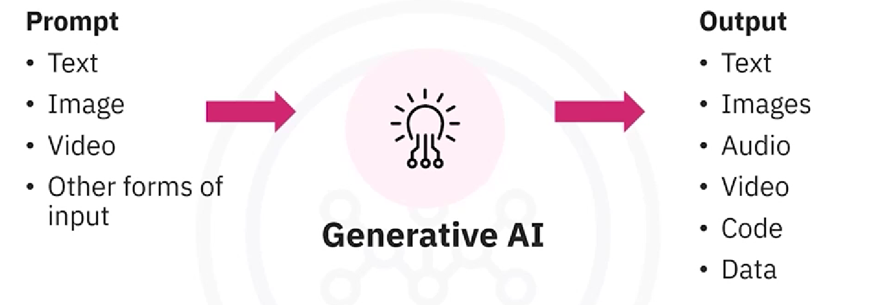

## Generative AI Application Basics
What I'll learn
- The basics of Generative AI
- Prompt Engineering 
- In-context Learning
- Prompt Templates
- Introduction to LangChain framework

## RAG Applications
What I'll learn
- What is RAG
- Implement RAG using LangChain
- Introduction to Gradio, which helps set up an interface to interact with AI models
- LlamaIndex as an alternative to LangChain
- Build a bot with LlamaIndex and IBM's Granite model

## Vector Databases
What I'll learn
- What is vector databases
- Gaining insights in ChromaDB's architecture
- Build a recommendation using vector database and embedding models

## Advanced RAG with Vector Databases
What I'll learn
- Introduction to Advanced Retrievers
- Introduction to Retriever Patterns
- FAISS, a powerful vector database for efficient similarity search
- Build RAG application using FAISS, LangChain and Gradio

## Multimodal Generative AI application
What I'll learn
- Introduction to Multimodal AI
- Speech Recognition
- Text-to-speech technologies
- Computer vision
- Using OpenAI Whisper, or Mistral to develop multimodal applications
- Exploring how DALL.E generate images and the fundamentals of image captioning
- Multimodal retrieval and search
- Multimodal question answering and chatbots

##  Building AI Agents
What I'll learn
- Cover AI Agents including, calling, chaining, and tool orchestration
- Manual tool calling
- Leverage LangChain's built-in agents, including DataFrame and SQL agents

## Agentic AI with LangChain and LangGraph
What I'll learn
- Using LangChain and LangGraph to develop stateful workflows
- Exploring key architectures such as agents and React agents
- Introduction to multi-agent system design and agentic RAG architecture

## Agentic AI with LangGraph, CrewAI, AutoGen and BeeAI
What I'll learn
- AI workflows and design patterns
- Agentic frameworks such as CrewAI and LangGraph
- IBM's BeeAI frameworks
- AG2 (AutoGen)


## Introduction to Generative AI
### **How generative AI differ from discriminative AI**

==Discriminative AI== distinguishes different classes of data and use those data to predict new data. They use advanced algorithms like differentiate, classify
Limitations
- Cannot understand context
- Cannot generate new content
==Generative AI== create new content based on training data


> Both Discriminative AI and Generative AI are created by using Deep Learning. The creative skills of AI come from
> - Generative Adversarial Network (GANs)
> - Variational autoencoder(VAEs)
> - Transformers
> - Difusion Model 

### What are Applications of Generative AI
**IT & DevOps**
Applications
- Code generation: Autocompleting or writing functions/programs → saves time & reduces repetitive work.
- Code reviews: Tools like GitHub Copilot, Snyk’s DeepCode → improve code quality & maintainability.
- Testing: Tools like Applitools, Testim → create synthetic test data, improve coverage, simulate user behaviors.
- Monitoring & anomaly detection: IBM Watson AIOps, Moogsoft AIOps → analyze logs & metrics for proactive troubleshooting.
CI/CD automation: GitLab Duo → automates release notes, deployment scripts.

✅ Impact: Faster delivery, fewer bugs, proactive maintenance.
⚠️ Challenge: AI can hallucinate wrong code → still needs human oversight.
...
### What are used tools for text, image, audio, code
#### Tools For Text Generation
- ChatGPT (OpenAI, GPT-based)
- Google Bard (PaLM-based, Google Pathways AI)
- Jasper → marketing content (blogs, ads, brand voice).
- Rytr → blogs, SEO, emails, ads.
- Copy.ai → product descriptions & social media text.
- Writesonic → structured templates (articles, ads, posts).
- Resoomer → summarizes text.
- uClassify → text classification.
- Brand24 / Repustate → sentiment analysis.
- Language Weaver / Yandex → multilingual translation.

#### Tools For Image Generation
**Models**:
- DALL-E (OpenAI): GPT-based, trained on large datasets of image+text.
Features: photorealism, paintings, inpainting, outpainting, multiple variations.
- Stable Diffusion: Open-source diffusion model, primarily text-to-image, also supports inpainting/outpainting.
- StyleGAN (NVIDIA): Separates content vs. style, enabling fine-grained control (pose, facial expression). Produces high-res realistic images.
**Tools**
- Free text-to-image tools: Craiyon, Freepik, Picsart.
- Pretrained styles: Fotor, Deep Art Effects, DeepArt.io.
- Community-driven generation: Midjourney.

#### 📌 Generative AI vs. Agentic AI
==Generative AI==
**Definition:**
- Reactive systems.
- Wait for a user prompt, then generate content (text, image, code, audio, etc.).
- “Pattern-matching machines” → trained on large datasets to predict the next word, pixel, or sound.

**Lifecycle**: Prompt → Generate output → Stop.
**Examples:**
- ChatGPT writing fanfiction.
- YouTuber using AI to generate thumbnails, review scripts, suggest background music.
**Role of Human**: Humans curate, refine, and direct. AI is like a tool that offers possibilities, but doesn’t act beyond generation.

==Agentic AI==
**Definition:**
- Proactive systems.
- Start with a goal (possibly from a prompt), then take a series of actions to achieve it.
- Operates in a loop: Perceive → Decide → Act → Learn → Repeat, with minimal human intervention.
**Lifecycle:** Goal → Break into steps → Take actions → Adjust → Continue until outcome.

**Examples:** 
- Personal shopping agent: Finds products, monitors price, handles checkout & delivery.
- Conference planning agent: Breaks down tasks (budget → venues → availability → logistics).

**Core Mechanism:** Uses LLMs for reasoning with chain-of-thought → breaks complex tasks into smaller logical steps.
**Role of Human:** Humans supervise, but much of the process is autonomous.

## Prompt Engineering Basics

> **What is a prompt**: is any input you give generative AI. An effective prompt includes instruction, context, input, output indicators

> **What is a prompt engineering:** = the process of designing and refining prompts to guide generative AI models toward accurate, relevant, and safe outputs. it includes 
>- Context → background, conditions, or constraints.
>- Information → data or specifics to ground the response.
>- Expectations → what kind of output you want (tone, detail, style).

📌 Prompt Creation Formula
**[Role/Persona] + [Task/Goal] + [Context/Constraints] + [Precision/Format]**
Example:
"You are a technical writer. Write a beginner-friendly explanation of cloud computing, using the analogy of renting vs. owning a house. Present 3 benefits and 2 risks in a table format."
**Popular Prompt Engineering Tools**
- IBM Watsonx.ai (Prompt Lab)
- Spellbook (by Scale AI)
- Dust
- PromptPerfect

### Prompt Engineering Techniques
##### Text-to-text prompt technique
- Task Specification: Give explicit, clear instructions.
- Contextual Guidance: Provide specific details/context to steer the model.
- Domain Expertise: Use field-specific terminology when asking for specialized content.
- Bias Mitigation: Explicitly ask for neutral or balanced responses.
- Framing: Put constraints (word limits, focus areas, etc.) in the prompt.
- Zero-Shot Prompting: Ask the model to do something without providing examples.
- User Feedback Loop: Iteratively refine prompts based on output.
- Few-Shot Prompting: Provide examples in the prompt to guide the model.
##### Interview Pattern
Instead of giving one long, static prompt, you instruct the model to ask you structured, follow-up questions
Example
```java
User gives a meta-instruction to act in interview mode.
Example: “You are a seasoned travel expert. Begin by asking me a 
series of questions to plan a personalized trip.”
Model asks structured follow-up questions, one at a time.
e.g., “What destinations do you enjoy most?”
User provides answers, giving context.
Model uses accumulated info → generates a well-optimized response (e.g., travel itinerary).
```

##### Chain of Thought (CoT)
Makes AI think step-by-step rather than jumping straight to an answer

##### Tree-of-Thought
Tree-of-Thought approach extends beyond Chain-of-Thought by not just following one reasoning path, but instead branching out into multiple possibilities (like a decision tree).

##### Playoff Method
- Generate a Set of Responses: Start by creating a list of potential responses or prompts for a given task.
- Pair Responses: Group these responses into pairs (e.g., four responses would be paired into two groups).
- Evaluate and Select: In each pair, evaluate the responses based on pre-defined criteria (e.g., clarity, relevance, creativity) and select the better one.
- Continue the Tournament: Keep pairing and evaluating the remaining responses in subsequent rounds until one response emerges as the winner.
- Final Selection: The last remaining response is chosen as the optimal one.

## Generative AI: Foundation Models and Platforms

==The four core generative AI models are:==
- **Variational Autoencoders (VAEs)** → compress data into a latent space, then reconstruct it. Good for image synthesis, anomaly detection, forecasting.
- **Generative Adversarial Networks(GANs)** → generator vs discriminator in a game, producing ultra-realistic images and deepfakes. Great for image generation, style transfer, but hard to train.
- **Transformer-based Models**→ use attention mechanisms to process long sequences (text/audio). Foundation of Large Language Models (LLMs) like GPT and BERT.
- **Diffusion Models** → gradually add/remove noise to generate ultra-high-quality images and videos. Powerhouses behind DALL·E 2, Stable Diffusion, Imagen.

#### Variational AutoEncoder
**How it works:**
- Encoder compresses input data → latent space (compact mathematical representation).
- Decoder reconstructs data from latent space → output.
- Trained using maximum likelihood principle (minimize input vs output difference).

- **Key Feature**: Latent space is continuous → allows generating new data samples by sampling points in it.

Strengths:
- Works with images, text, audio.
- Efficient with small training data.
- Good for data compression & anomaly detection.

Use cases:
- Entertainment: game maps, avatar animation.
- Finance: stock volatility modeling.
- Healthcare: detecting diseases from ECG.

#### Generative Adversarial Networks (GANs)
**How it works:**
- Two CNNs compete:
- Generator → creates fake samples.
- Discriminator → distinguishes real vs fake.
- Generator improves until discriminator can’t tell the difference.

Key Feature: Adversarial training → hyper-realistic outputs.

Strengths:
- Generates extremely realistic images/videos.
- Can do style transfer (turn photo into painting) or image-to-image translation.
Weaknesses:
- Needs huge data + compute.
- Training is unstable.
- Ethical concerns (deepfakes, fake data).

Use cases:
- Deepfake generation.
- StyleGAN → create characters.
- Finance → time-series generation.
- SpaceGAN → geospatial data modeling.

#### Transformer-Based Models
**How it works:**
- Uses attention mechanism → focuses only on important parts of data.
- Encoder-decoder structure for tasks like translation.

Key Feature: Can handle very long sequences of text, images, audio.

Strengths:
- Scales to Large Language Models (LLMs).
- Versatile: NLP, image generation, music, video.

Use cases:
- GPT (OpenAI), BERT, T5.
- Chatbots, translation, content generation.

#### Diffusion Models
**How it works:**
- Forward diffusion → gradually adds noise to training data.
- Reverse diffusion → removes noise step by step → reconstructs data.

Key Feature: Extremely high-quality generations, even better than GANs for images.

Strengths:
- Can train with hundreds/thousands of layers.
- Excellent for image/video generation.
- More stable training compared to GANs.

Weaknesses:
- Slower to train and generate.

Use cases:
- DALL·E 2, Stable Diffusion, Imagen.
- Photorealistic art, synthetic data for training, video synthesis.