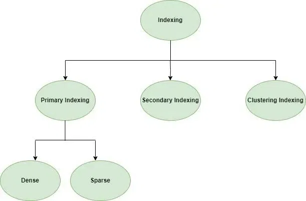

## 1. Composite Key vs Surrogate Key

### Understanding the Choice

When designing many-to-many relationships, you face a fundamental decision between using composite keys or surrogate keys. This choice affects both performance and future flexibility.

### Composite Key Approach

A composite key combines multiple columns to create a unique identifier. In many-to-many relationships, this typically means using foreign keys from both related tables as the primary key.

**Performance Characteristics:**

- Creates a clustered index on the composite key by default
- Database physically arranges data on disk based on this key structure
- Uses B-Tree data structure for efficient range queries
- Lookup operations can narrow results more efficiently through the tree structure

### Surrogate Key Approach

A surrogate key is a generated identifier (like an auto-incrementing integer) that serves as the primary key when natural keys aren't suitable.

**Performance Characteristics:**

- Requires a separate unique constraint on the foreign key combination
- Creates a non-clustered index on the foreign keys
- Database engine must perform additional lookups: first find matching rows in the index, then retrieve actual data
- Generally involves more I/O operations for queries

### Future Evolution Considerations

Surrogate keys provide cleaner abstraction for future changes. If you later need to add a third table (like "assignment_course"), surrogate keys make relationships more explicit and manageable.

## 2. Fail-Fast vs Fail-Safe Iterators in Java

### System Design Philosophy

Understanding fail-fast and fail-safe approaches helps you design more robust systems.

**Fail-Fast Systems:**

- Immediately stop operation when errors occur
- Expose errors right away to prevent further damage
- Maintain system integrity through proactive fault handling
- Prioritize correctness over availability

**Fail-Safe Systems:**

- Continue operating despite errors
- Provide uninterrupted service by hiding faults from users
- May attempt error recovery while maintaining operation
- Prioritize availability over consistency

### Iterator Implementation Details

**Fail-Fast Iterators:**
Fail-fast iterators use a modification counter (modCount) to detect concurrent changes. When the iterator is created, it captures the current modCount value. Each call to next() compares the captured value with the current modCount. If they differ, a ConcurrentModificationException is thrown.

This mechanism prevents potential data corruption that could occur from concurrent modifications during iteration.

**Fail-Safe Iterators:**
Fail-safe iterators operate on a cloned copy of the collection. This approach ensures that the iterator works with a stable snapshot of data, avoiding concurrent modification issues entirely. However, any changes to the original collection after iterator creation won't be reflected in the iteration.

## 3. Transaction Annotations: Jakarta vs Spring

### Jakarta Transaction API

`@jakarta.transaction.Transactional` represents the standard Jakarta EE specification. Using this annotation means relying on the Jakarta Transaction API, which provides basic transaction management capabilities.

### Spring Transaction Management

`@org.springframework.transaction.annotation.Transactional` offers Spring Framework's enhanced transaction management with significantly more flexibility and features.

**Key Advantages of Spring's Approach:**

- Granular control over transaction behavior
- Detailed rollback condition specifications
- Configurable timeout values
- Advanced isolation level management

### Transaction Propagation Behavior

**REQUIRED (Default):**
When a transactional method calls another transactional method, the called method joins the existing transaction if one exists. If no transaction exists, Spring creates a new one.

**REQUIRES_NEW:**
Always creates a new transaction, suspending any existing transaction. This is particularly useful when you need certain operations to commit regardless of what happens in the outer transaction. Think of it as "freezing" the outer transaction while creating a completely separate transaction with its own database connection.

**NESTED:**
Creates a nested transaction using savepoints. This keeps the same database connection but creates a rollback point. If an error occurs in the nested section, Spring rolls back to the savepoint, undoing only the nested section while allowing the outer transaction to continue.

**Key Difference Between REQUIRES_NEW and NESTED:**

- REQUIRES_NEW consumes an additional database connection and operates independently
- NESTED uses the same connection with savepoints, and the entire transaction (outer + nested) commits together

### Isolation Levels

Isolation levels control how concurrent transactions interact:

**READ_UNCOMMITTED:**
Allows reading data that other transactions have modified but not yet committed. This can lead to dirty reads but offers the highest performance.

**READ_COMMITTED:**
Ensures you only read committed data, preventing dirty reads. However, it still allows non-repeatable reads where the same query might return different results if another transaction commits changes between your reads.

**REPEATABLE_READ:**
Ensures that reading the same data twice in a transaction returns the same result. This prevents non-repeatable reads but still allows phantom reads.

**SERIALIZABLE:**
The strictest isolation level, making concurrent transactions behave as if they were executed sequentially. This prevents all concurrency issues but can significantly impact performance.

### Concurrency Phenomena

**Dirty Read:**
Occurs when one transaction reads data that another transaction has modified but not yet committed. This can lead to inconsistent data if the modifying transaction rolls back.

**Non-repeatable Read:**
Happens when you read the same data twice within a transaction and get different results because another transaction modified and committed the data between your reads.

**Phantom Read:**
Occurs when you run the same query twice and get different numbers of rows because another transaction inserted or deleted rows that match your query criteria.

### Read-Only Transaction Optimization

Marking transactions as read-only enables several optimizations:

- Database can optimize locking strategies, using more efficient mechanisms
- Connection pooling can route queries to read replicas in master-slave setups
- Reduces contention with other transactions

## 4. Database Locking Strategies

### Lock Types

**Shared vs Exclusive Locks:**

- Shared locks allow multiple readers simultaneously but prevent writers
- Exclusive locks allow only one holder at a time, blocking both readers and writers

**Granularity Levels:**

- Table-level locking is simple but limits concurrency dramatically
- Row-level locking is more sophisticated, allowing higher concurrency

**Locking Philosophies:**

- Pessimistic locking assumes conflicts will occur and prevents them by acquiring locks early
- Optimistic locking assumes conflicts are rare and checks for them only when committing changes

## 5. Master-Slave Architecture Implementation

```java
@Configuration
public class DatabaseConfig {

    @Bean
    @Primary
    public DataSource dataSource() {
        return new RoutingDataSource();
    }

    public class RoutingDataSource extends AbstractRoutingDataSource {

        @Override
        protected Object determineCurrentLookupKey() {
            // Route based on transaction type
            if (TransactionSynchronizationManager.isCurrentTransactionReadOnly()) {
                return "slave"; // Route to read replica
            }
            return "master"; // Route to master for writes
        }
    }

    @Bean
    public DataSource masterDataSource() {
        return DataSourceBuilder.create()
            .url("jdbc:postgresql://master-db:5432/myapp")
            .username("app_user")
            .password("secure_password")
            .build();
    }

    @Bean
    public DataSource slaveDataSource() {
        return DataSourceBuilder.create()
            .url("jdbc:postgresql://slave-db:5432/myapp")
            .username("app_user")
            .password("secure_password")
            .build();
    }
}
```

This configuration automatically routes read-only transactions to slave databases while directing write operations to the master database.

## 6. Optimistic Locking in JPA

### Implementation Mechanism

Optimistic locking requires an entity with a `@Version` annotation. Each transaction that reads data holds the version property value. Before committing updates, the transaction checks if the version has changed. If it has, an OptimisticLockException is thrown; otherwise, the update proceeds and the version is incremented.

### Lock Modes

**OPTIMISTIC/READ:**
Checks version at commit time for data that was read during the transaction.

**OPTIMISTIC_FORCE_INCREMENT/WRITE:**
Forces version increment even without changes, useful for signaling modifications to downstream systems.

## 7. Pessimistic Locking in JPA

### Lock Modes

**PESSIMISTIC_READ:**
Obtains a shared lock for reading data without encountering dirty reads. Prevents updates or deletes but allows other readers.

**PESSIMISTIC_WRITE:**
Obtains an exclusive lock, preventing the data from being read, updated, or deleted by other transactions.

**PESSIMISTIC_FORCE_INCREMENT:**
Works like PESSIMISTIC_WRITE but additionally increments the version attribute of versioned entities.

### Lock Scope

**NORMAL:**
Locks only the targeted entity and its joined inheritance tables.

**EXTENDED:**
Locks the entity and any related data collections through JOIN TABLE FOR UPDATE.

### Timeout Configuration

```java
Account fromAccount = entityManager.find(Account.class, fromAccountId,
    LockModeType.PESSIMISTIC_WRITE,
    Collections.singletonMap("javax.persistence.lock.timeout", 5000));
```

Setting timeouts prevents deadlocks by ensuring locks don't wait indefinitely.

## 8. Caching Strategies in Spring

### Spring Cache Abstraction

**@Cacheable Annotation:**
Automatically caches method return values using method parameters as cache keys. Spring intelligently generates composite keys from parameters, so different parameter combinations create separate cache entries.

**Advanced Key Generation:**
Spring Expression Language (SpEL) enables custom cache key creation for complex scenarios.

### Cache Lifecycle Management

**@CacheEvict:**
Removes entries from cache, perfect for delete operations.

**@CachePut:**
Updates cache with new values, ideal for update operations.

### Hibernate Caching Hierarchy

**First-Level Cache (Session Cache):**
Ensures that within a single transaction, repeated queries for the same entity return the same object instance.

**Second-Level Cache (SessionFactory Cache):**
Shared across sessions and transactions, caching entities and collections by identifier with automatic invalidation on updates.

**Query Cache:**
Stores results of frequently executed queries, working alongside L2 cache to cache result sets.

### Cache Concurrency Strategies

**READ_ONLY:**
Best performance for data that never changes after creation.

**NONSTRICT_READ_WRITE:**
Suitable for infrequently changing data with acceptable brief staleness.

**READ_WRITE:**
Provides strict consistency through locking mechanisms.

**TRANSACTIONAL:**
Most restrictive strategy ensuring full ACID compliance.

## 9. Session vs Token Authentication

### Session Limitations

Traditional sessions store data on the server, leading to:

- High storage pressure
- Issues in distributed environments
- Session inconsistency in horizontal scaling scenarios

### Token-Based Authentication

**Access Tokens:**
Short-lived tokens designed for resource access. Their brief lifespan limits damage if stolen, since there's typically no built-in revocation mechanism.

**Refresh Tokens:**
Long-lived tokens that eliminate repeated login processes. Unlike access tokens, refresh tokens can be revoked because they're stored server-side.

### Token Revocation Strategies

**Whitelisting:**
Stores valid tokens in a persistent data store. Tokens not found in the whitelist are considered invalid.

**Blacklisting:**
Adds revoked tokens to a blacklist. During verification, tokens found in the blacklist are rejected.

## 10. JWT Storage Security

### Storage Options Analysis

**localStorage:**
Persists across browser sessions but is vulnerable to XSS attacks since any JavaScript can access it.

**sessionStorage:**
Similar XSS vulnerability but tokens disappear when browser tabs close.

**HTTP-only Cookies:**
Provides strong XSS protection since JavaScript cannot access these cookies, but becomes vulnerable to CSRF attacks.

### Attack Vectors

**XSS (Cross-Site Scripting):**
Malicious scripts injected into webpages can read tokens from localStorage or sessionStorage.

**CSRF (Cross-Site Request Forgery):**
Malicious sites can trick users into making unwanted requests using HTTP-only cookies.

## 11. Authentication Evolution: Cookie → Session → JWT

### Cookie Era

Early web applications stored user data directly in cookies, but this approach had significant limitations:

- 4KB size limit per cookie
- Client-side storage vulnerability
- Network overhead from including data in every request

### Session Improvement

Sessions addressed cookie limitations by storing only session identifiers in cookies while keeping actual user data on the server. This approach:

- Fits within cookie size limits
- Prevents client-side data modification
- Reduces network overhead

### JWT Innovation

JWT solves scaling problems by eliminating server-side session storage, but introduces new challenges:

- Token size limitations (typically under 8KB)
- Difficulty with immediate revocation
- Need for complementary storage for large user data

## 12. Token Compromise Detection

### Detection Strategy

Systems can detect compromised tokens by monitoring usage patterns and implementing token rotation policies.

### Token Rotation Mechanism

When access tokens expire, both access and refresh tokens are replaced with entirely new pairs. The old tokens are blacklisted to prevent reuse.

### Family-Based Tracking

Token families use persistent identifiers across rotations. Each refresh token has:

- Unique identifier (JTI)
- Family identifier that persists across rotations
- Relationship tracking for security monitoring

When a blacklisted refresh token is used, the system can identify and revoke all related tokens in the family.

## 13. SOLID Principles

### Single Responsibility Principle (SRP)

Each class should have only one reason to change, focusing on a single responsibility.

**Violation Example:**

```java
class Student {
    public void registerStudent() { /* Registration logic */ }
    public void calculateGrade() { /* Grade calculation */ }
    public void sendEmail() { /* Email notification */ }
}
```

**Correct Implementation:**

```java
class Student {
    public void registerStudent() { /* Registration only */ }
}

class GradeCalculator {
    public void calculateGrade() { /* Grade calculation only */ }
}

class EmailSender {
    public void sendEmail() { /* Email sending only */ }
}
```

### Open/Closed Principle (OCP)

Software entities should be open for extension but closed for modification.

**Violation Example:**

```java
class AreaCalculator {
    public double calculateArea(Shape shape) {
        if (shape.type.equals("circle")) { /* Circle calculation */ }
        else if (shape.type.equals("square")) { /* Square calculation */ }
        // Adding new shapes requires modifying this method
    }
}
```

**Correct Implementation:**

```java
interface Shape {
    double calculateArea();
}

class Circle implements Shape {
    @Override
    public double calculateArea() { /* Circle-specific calculation */ }
}

class Square implements Shape {
    @Override
    public double calculateArea() { /* Square-specific calculation */ }
}
```

### Liskov Substitution Principle (LSP)

Subtypes must be substitutable for their base types without breaking functionality.

**Violation Example:**

```java
class Bird {
    public void fly() { /* Flying behavior */ }
}

class Ostrich extends Bird {
    @Override
    public void fly() {
        throw new UnsupportedOperationException(); // Breaks substitutability
    }
}
```

**Correct Implementation:**

```java
class Bird { /* Base bird behavior */ }

class FlyingBird extends Bird {
    public void fly() { /* Flying behavior */ }
}

class Sparrow extends FlyingBird { /* Can fly */ }
class Ostrich extends Bird { /* Cannot fly, doesn't inherit flying behavior */ }
```

### Interface Segregation Principle (ISP)

Clients should not be forced to depend on interfaces they don't use.

**Violation Example:**

```java
interface Worker {
    void work();
    void eat();
}

class Robot implements Worker {
    public void work() { /* Work implementation */ }
    public void eat() { /* Forced to implement despite not eating */ }
}
```

**Correct Implementation:**

```java
interface Workable {
    void work();
}

interface Eatable {
    void eat();
}

class Human implements Workable, Eatable {
    public void work() { /* Work implementation */ }
    public void eat() { /* Eat implementation */ }
}

class Robot implements Workable {
    public void work() { /* Work implementation only */ }
}
```

### Dependency Inversion Principle (DIP)

High-level modules should not depend on low-level modules. Both should depend on abstractions.

**Violation Example:**

```java
class LightBulb {
    public void turnOn() { /* Turn on light */ }
}

class Switch {
    private LightBulb bulb; // Direct dependency on concrete class

    public void press() {
        bulb.turnOn();
    }
}
```

**Correct Implementation:**

```java
interface Switchable {
    void activate();
}

class LightBulb implements Switchable {
    @Override
    public void activate() { /* Turn on light */ }
}

class Fan implements Switchable {
    @Override
    public void activate() { /* Turn on fan */ }
}

class Switch {
    private Switchable device; // Depends on abstraction

    public Switch(Switchable device) {
        this.device = device; // Dependency injection
    }

    public void press() {
        device.activate();
    }
}
```

### SOLID Benefits Summary

| Principle | Primary Purpose                | Key Benefit                                    |
| --------- | ------------------------------ | ---------------------------------------------- |
| **SRP**   | Reduce complexity              | "One class, one job"                           |
| **OCP**   | Enable extension               | "Add new, don't modify existing"               |
| **LSP**   | Preserve behavior              | "Subclass replaces parent seamlessly"          |
| **ISP**   | Avoid unnecessary dependencies | "Small, focused interfaces"                    |
| **DIP**   | Reduce coupling                | "Depend on abstractions, not concrete classes" |

Applying SOLID principles results in:

- Fewer bugs when requirements change
- Easier testing of individual components
- Better code reusability
- Reduced maintenance costs
- More maintainable and scalable software architecture

## Indexing in Databases

Indexing is a crucial technique used in databases to optimize data retrieval operations. It improves query performance by minimizing disk I/O operations, thus reducing the time it takes to locate and access data. Essentially, indexing allows the database management system (DBMS) to locate data more efficiently without having to scan the entire dataset.

Indexes are organized data structures that allow quick searching based on key values. When an index is created for a database table, ==it maintains a sorted order of key values along with pointers to the actual data rows==. This process significantly reduces the number of disk accesses required to fulfill a query.

**Attributes of Indexing**
Several Important attributes of indexing affect the performance and efficiency of database operations:

1. **Access Types**: This refers to the type of access such as value-based search, range access, etc.
2. **Access Time**: It refers to the time needed to find a particular data element or set of elements.
3. **Insertion Time**: It refers to the time taken to find the appropriate space and insert new data.
4. **Deletion Time**: Time taken to find an item and delete it as well as update the index structure.
5. **Space Overhead**: It refers to the additional space required by the index.
   

### File Organization in Indexing

#### Sequential File Organization (Ordered Index File)

In this type of organization, the indices are based on a sorted ordering of the values. These are generally fast and a more traditional type of storing mechanism. These Ordered or Sequential file organizations might store the data in a dense or sparse format.


**Access Method**: To locate a record, we find the index record with the largest key value less than or equal to the search key, and then follow the pointers sequentially.

**Access Cost**: Accesses=log⁡2(n)+1\text{Accesses} = \log_2(n) + 1Accesses=log2​(n)+1, where nnn is the number of blocks involved in the index file.

#### Hash File Organization

In hash file organization, data is distributed across a range of buckets based on a hash function applied to the key values. The hash function maps each key to a particular bucket, where the corresponding data can be located.

### Types of Indexing Methods

#### Primary Index (Clustered Index)

Physically orders table data on disk according to the index key
Only one per table (since data can only be physically sorted one way)
Contains actual data pages, not just references
Fastest for range queries on the indexed column
Example: Employee table clustered by employee_id means records are physically stored in ID order


#### Non-clustered or Secondary Indexing
A non-clustered index just tells us where the data lies, i.e. it gives us a list of virtual pointers or references to the location where the data is actually stored. Data is not physically stored in the order of the index. Instead, data is present in leaf node

#### Multilevel Indexing
With the growth of the size of the database, indices also grow. As the index is stored in the main memory, a single-level index might become too large a size to store with multiple disk accesses. The multilevel indexing segregates the main block into various smaller blocks so that the same can be stored in a single block.

The outer blocks are divided into inner blocks which in turn are pointed to the data blocks. This can be easily stored in the main memory with fewer overheads. This hierarchical approach reduces memory overhead and speeds up query execution.

