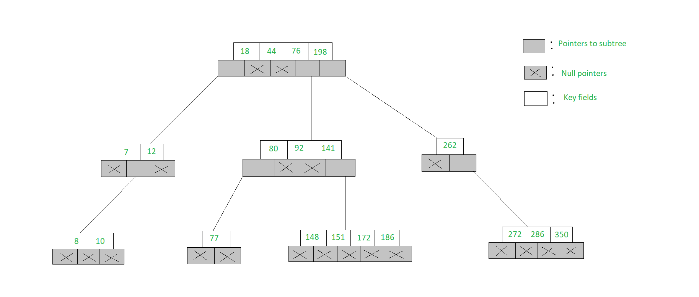

## Introduction of B-Tree

==A B-Tree is a specialized m-way tree designed== to optimize data access, especially on disk-based storage systems.

- In a B-Tree of order m, each node can have up to m children and m-1 keys, allowing it to efficiently manage large datasets.
- The value of m is decided based on disk block and key sizes.
- One of the standout features of a B-Tree is its ability to store a significant number of keys within a single node, including large key values. It significantly reduces the tree’s height, hence reducing costly disk operations.
- B Trees allow faster data retrieval and updates, making them an ideal choice for systems requiring efficient and scalable data management. By maintaining a balanced structure at all times,
- B-Trees deliver consistent and efficient performance for critical operations such as search, insertion, and deletion.

> **What is m-way Tree**?

The m-way search trees are multi-way trees which are generalised versions of binary trees where each node contains multiple elements. In an m-Way tree of order m, each node contains a maximum of m - 1 elements and m children.

The goal of m-Way search tree of height h calls for O(h) no. of accesses for an insert/delete/retrieval operation. Hence, it ensures that the height h is close to log_m(n + 1).
The number of elements in an m-Way search tree of height h ranges from a minimum of h to a maximum of m^h^ - 1

A B-Tree is a specialized m-way tree designed to optimize data access, especially on disk-based storage systems.

---

**Properties of a B-Tree**
A B Tree of order m can be defined as an m-way search tree which satisfies the following properties:
All leaf nodes of a B tree are at the same level, i.e. they have the same depth (height of the tree).
The keys of each node of a B tree (in case of multiple keys), should be stored in the ascending order.
In a B tree, all non-leaf nodes (except root node) should have at least m/2 children.
All nodes (except root node) should have at least m/2 - 1 keys.
If the root node is a leaf node (only node in the tree), then it will have no children and will have at least one key. If the root node is a non-leaf node, then it will have at least 2 children and at least one key.
A non-leaf node with n-1 key values should have n non NULL children.

> **Interesting Facts about B-Tree**
> The minimum height of the B-Tree that can exist with n number of nodes and m is the maximum number of children of a node can have is: **h~min~ = [log~m~(n + 1)] - 1**
> The maximum height of the B-Tree that can exist with n number of nodes and t is the minimum number of children that a non-root node can have is: **h~max~ = [log~t~(n + 1)/2 ] and t = [m / 2]**
>
> > **Need of a B-Tree**

## Introduction of B+tree

## What is a Distributed Lock?

A distributed lock is a mechanism that allows coordinated access to shared resources in a distributed environment, ensuring that only one process can access a particular resource at a time

