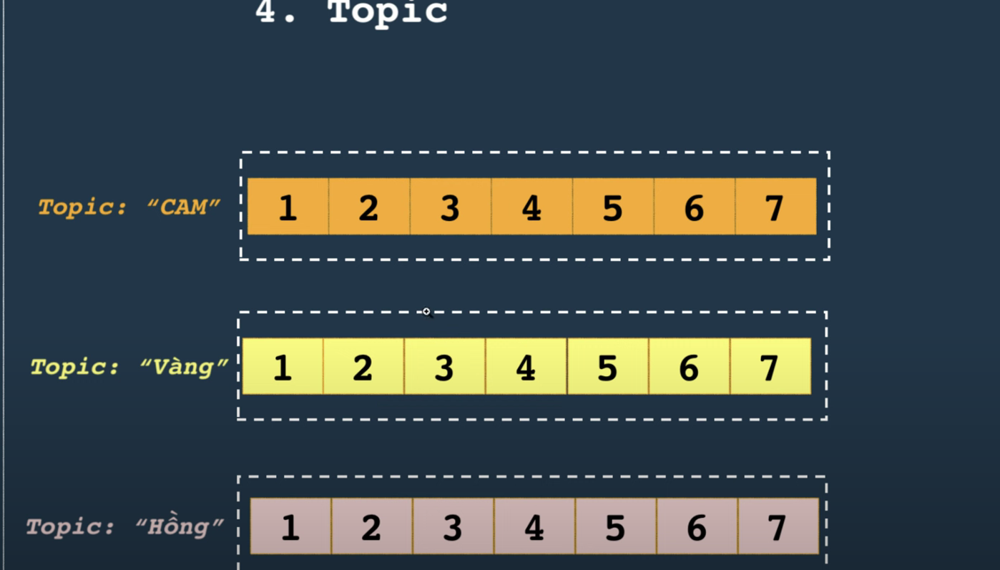
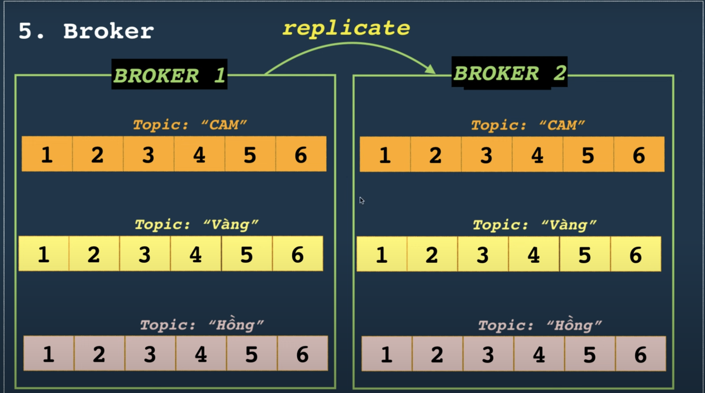
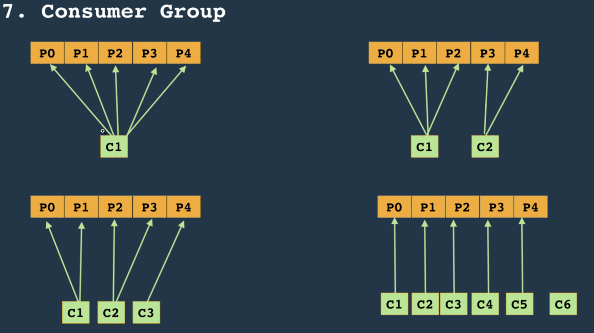

# Kafka

## Kafka's components
### Topic
- **What**: Logical category or feed name to which records are published.
- **Key details**: Topics are split into partitions for parallelism and ordering guarantees (ordering is only within a partition).
- **Why it matters**: Topic design affects throughput and consumer parallelism.


> Nói 1 cách dễ hiểu là topic có nghĩa là 1 cái chủ đề, thì nó sinh ra để giải quyết vấn đề là 1 message queue không thể xử lý lượng đồng thời cao, và trong kafka chúng ta có thể sử dụng topic (bản sao của queue) khác nhau để xử lý dữ liệu khác nhau, từ đó producers khác nhau cũng có thể lưu trữ dữ liệu trong các queues khác nhau, và các consumers khác nhau cũng có thể đăng ký các queues khác nhau --> tăng hiệu suất
### Partition
- **What**: An ordered, immutable sequence of messages (a log). Each message in a partition has a monotonically increasing offset.
- **Key details**: Partitions are the unit of parallelism. More partitions → more parallel consumers but more overhead.
- **Failure modes**: Rebalancing when partitions move can cause short consumer pauses.
> Vậy làm thế nào khi mà 1 topic có quá nhiều dữ liệu. Lúc này ==Partition== ra đời nó chia topic thành các phân vùng để improve performance. Each partition can run paralelly without affecting others.
> **Disadvantage**: Because a topic can have a lot of partitions so it is hard or somehow cannot guarantee the order of messages in every partition, but the order in a partition will always be guaranteed 
- **Partition strategies**: ...
### Broker
- **What**: A Kafka server/node that holds partitions (their data) and serves producer/consumer requests.
- **Key details**: Multiple brokers form a cluster. Each partition has a leader broker and zero or more follower replicas.
- **Ops notes**: Monitor disk, network, JVM GC. Add brokers to scale.

### Cluster & Controller
- What: Cluster = group of brokers. One broker acts as controller (or in newer setups, a dedicated controller quorum in KRaft).
- Role: Controller manages partition leadership elections, metadata changes.
- Note: Historically Kafka used ZooKeeper for cluster metadata; newer architectures (KRaft) move controller functionality inside Kafka.

### Producer
- What: Client that writes events to topics.
- Key details: Can choose partitioning key (to control ordering). Configs: acks (0,1,all), retries, max.in.flight.requests, linger.ms, batch.size.
- Trade-offs: acks=all + retries gives durability; acks=1 is faster but riskier.

### Consumer
- **What**: Client that reads messages from topics.
- **Key details**: Consumers track offsets (where they are in a partition). They can commit offsets (auto or manual).
- **Consumer Group**: A set of consumers with the same group id — Kafka guarantees each partition is consumed by only one consumer in the group (scales horizontally).
- **Lag**: Difference between latest offset and committed offset — critical metric.
> Within a single consumer group, each partition is served by at most one active consumer at a time.

For example:
> - Situation 1: one consumer so that it subscribes all partitions
> - Situation 2: two consumers C1 subscribes P0 -> P2, C2 subscribes P3, P4
### Offsets
- **What**: Numeric position in a partition log.
- **Important**: Consumers manage/commit offsets. You can rewind (replay) by resetting offsets.

### Replication, Leader/Follower, ISR
- Replication: Each partition is replicated across brokers for fault tolerance.
- Leader/Follower: Leader serves reads/writes; followers replicate.
- ISR (in-sync replicas): Followers that are caught up — min.insync.replicas config + acks=all define durability guarantees.

### Log segments & retention
- What: Partition data is stored in segment files; Kafka deletes/compacts segments based on retention policy.
- Retention modes:
    - Time/size-based retention: delete older segments.
    - Log compaction: keep latest record per key (useful for changelogs).
- Why: Enables replay and bounded storage.

### Transactions & Exactly-once semantics (EOS)
- What: Kafka supports transactional producers and idempotent producers to offer exactly-once processing semantics across topics/partitions (within constraints).
- When to use: Stream processing where duplicates are unacceptable. EOS adds complexity and some performance cost.

### ZooKeeper vs KRaft (cluster metadata)
- Historically: ZooKeeper stored cluster metadata and performed leader election.
- Newer direction: KRaft (Kafka Raft) embeds controller/quorum into Kafka, removing ZooKeeper dependency. (If you plan to operate a cluster, check your Kafka version and recommended deployment mode.)

### Kafka Connect
- What: Framework for moving data between Kafka and external systems (databases, S3, Elasticsearch) via connectors.
- Use-case: CDC, ETL, sink/source pipelines without custom code.

### Kafka Streams / ksqlDB
- What: Libraries/engines for stream processing directly on Kafka topics.
- Why: Build stateful or stateless real-time transforms, joins, aggregations, with fault-tolerance and changelogs.

### Schema Registry (Confluent) — optional but common
- What: Central store for message schemas (Avro/JSON/Protobuf), enabling schema evolution and compatibility checks.

```pgsql
+------------+        +---------+         +-------------+
|  Producers | -----> | Brokers | <-----> |  Consumers  |
+------------+        +----+----+         +------+------+
                           |
                    +------+------+
                    |  Replication |
                    |  (Leader/Fw) |
                    +------+------+
                           |
                    +------+------+
                    |  Storage:    |
                    |  Partitions  |
                    +-------------+

Extras: Kafka Connect <-> Brokers
        Kafka Streams apps <-> Brokers
        Schema Registry (optional)

```

