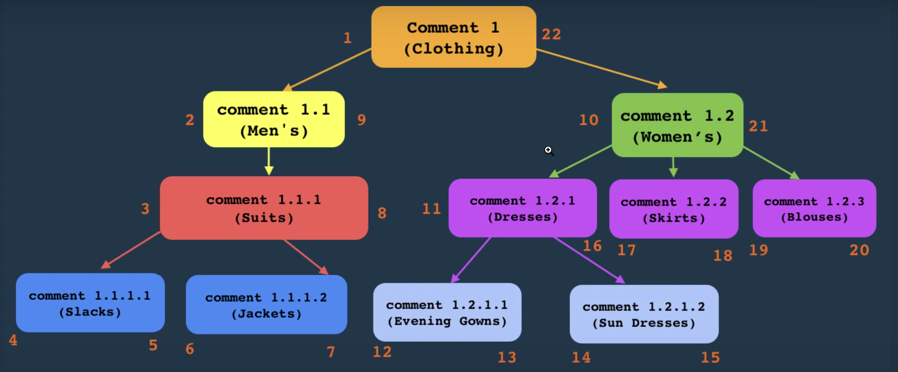
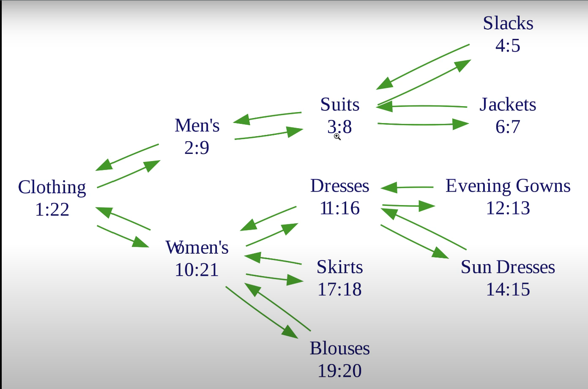
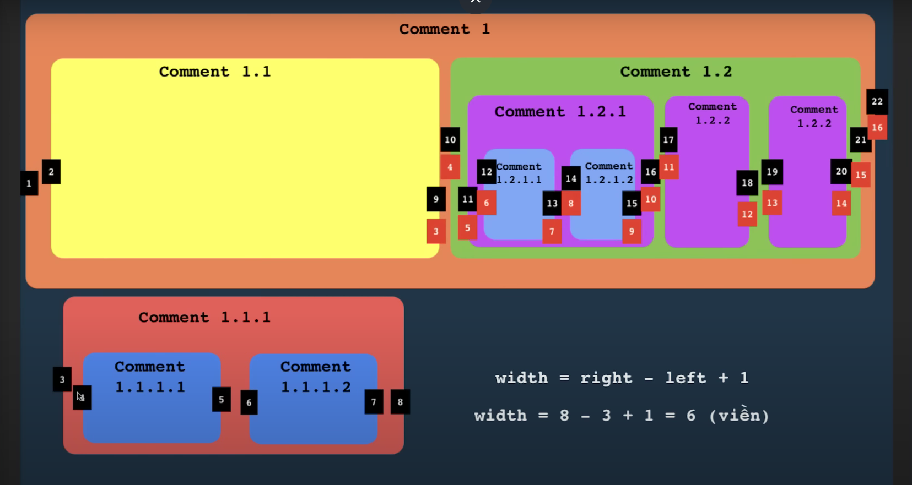
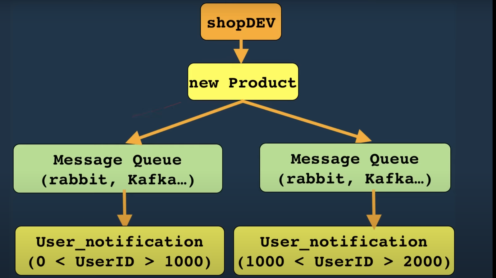

### Nested Comment Design (Joe Celko)

**DELETE Comment**

__Nested Set Model__: A Nested Set Model or called **Modified Preorder Tree Traversal (MPTT)** is a way to represent hierarchical data in a relational database using a specific structure that ==includes left and right values for each node==, allowing for efficient querying of parent-child relationships. The way it traverses like pre-order traversal of Tree.

Traversal order is from 1 to 22
Formula for looking a child comment, for instance I wanna look for all child comments of comment 1.1.1 so 
>__The formula goes like this__: All comments that have index > 3 && index < 8. 

### Message Queue
#### Step‑by‑Step Message Flow

**Produce:**
- Producer formats payload + headers, publishes to Exchange/Topic.
- Broker responds with confirm (if enabled).

**Route:**
- Broker examines routing key / topic filter.
- Matches to one or more queues via bindings.

**Store:**
- Message is persisted in the queue (disk or memory).

**Deliver:**
- Broker pushes (or consumer pulls) the message to a consumer.

**Acknowledge:**
- Consumer processes and sends ACK.
- On success → broker deletes message.
- On failure → NACK or no‐ack → broker re‐queues or DLQs after retries.
- Cleanup & Metrics:
- Broker updates metrics (throughput, retries, DLQ count).
- Monitoring dashboards surface health and performance.

##### Questions about Message Queue
> 1. How to gurantee messages are not lost
> 2. How to deal with duplicate messages
> 3. How to gurantee the order of messages
> 4. How to deal with accumulative messages 

**-->** Examples of using message queue 
