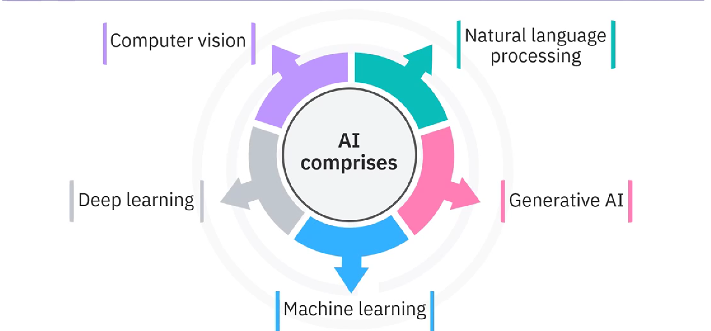

### Overview Of Machine Learning

- Definition: ==Machine learning (ML) is a branch of artificial intelligence (AI)== focused on enabling computers and machines to imitate the way that humans learn, to perform tasks autonomously, and to improve their performance and accuracy through experience and exposure to more data.

#### How machine learning works
Machine learning teaches computer to
- Learn from data
- Identify patterns
- Make decisions

Algorithms
- Use computational methods for learning information directly from data
- Does not rely on a fixed algorithm

**Supervised Learning** models train on labeled data to learn how to make inferences on new data, enabling them to predict otherwise labels

**Unsupervised Learning** works without labels by finding patterns in data

**Semi-supervised learning** trains on a relatively small subset of data that is already labeled and it iteratively retrains itself by adding new labels that it generates with reasonably high confidence

**Reinforcement Learning** stimulates artificial intelligence agent iterating with its environment and learns how to make decisions based on feedback from its environment

#### Machine learning techniques

**Classification** predicts class or category of a case --> ==*Supervised Learning*==
- Classification categorizes input data into several predefined categories or classes and them makes predictions about the class membership of new observations

**Regression/Estimation** predicts continuous values --> ==*Supervised Learning*==
- Regression predicts continuous numerical values from input data

**Clustering** groups of similar cases, for example, can find similar patients or can be used for customer segmentation in the banking field. --> ==*Unsupervised Learning*==
- It's used to group objects, data or items that are somehow similar
- Ungrouped data is considered "noise"

**Association** finds events or items that co-occur such as grocery item usually bought together by a particular customer or market segment
**Anomaly Detection** detects abnormal and unusual cases
**Sequence mining** predicts the next event
**Dimension reduction** is used to reduce data size
**Recommendation systems** associates people's preferences

#### Machine learning lifecycle

> Problem Definition --> Data Collection --> Data Preparation --> Model Development and Evaluation --> Model Deployment 
> These processes are iterative
- Data collection and data preparation are called the extract, transform, and load or **UTL process**

#### Tools For Machine Learning

Machine learning languages
- Julia: Parallel and distributed numerical computing support
- Scala: Processing big data and building ML pipelines
- Java: Supporting scalable ML applications
- JavaScript: Running ML models in web browsers

##### Types of Machine learning

**Data Processing And Analysis**: process, store and interact with data
- PostgreSQL
- Hadoop: Batch processing solution for big data
- Spark: Distributed, in-memory data processing framework for real-time big data processing
- Apache Kafka: Distributed real-time streaming analytics
- Pandas: Data wrangling and preprocessing
- Numpy: Numerical computing tools that provides comprehensive mathematical functions

**Data Visualization**: Helps you understand and visualize data structure
- Matplotlib: Customizable plots and interactive visualizations
- Seaborn: Attractive statistical graphics
- Ggplot2: Building and adding elements in layers
- Tableau: Interactive data visualization dashboard

**Machine Learning ecosystem**: create and tune models
- Pandas: Data wrangling and preprocessing
- Numpy: Numerical computing tools that provides comprehensive mathematical functions
- Scipy: Computing for optimization, integration, and linear regression
- Scikit-learn: Suite of classification, regression, clustering, and dimensionality reduction

**Computer Vision**: Object detection, Image classification, Facial recognition, Image segmentation
- OpenCV: Real-time computer vision applications
- Scikit-image: Image processing algorithms
- TorchVision: Popular data sets, image loading, pre-trained deep learning architecture, and image transformations

**Deep Learning**: Designing, training, and testing neural network-based models
- Tensorflow: Numerical computing and large scale ML
- Keras: Implementing neural networks
- Theano: Defining, optimizing, and evaluating mathematical expressions involving arrays
- Pytorch: Computer vision, NLP, and experimentation

**Natural Language Processing**: Help build applications that understand, interpret, and generate human language
- Natural Language Toolkit (NLTK): Text processing, Tokenization, and stemming
- TextBlob: Part-of-speech tagging, noun phrase extraction, sentiment analysis, and translation
- Stanza: Pre-trained models for tasks such as part-of-speech tagging, named entity recognition, and dependency parsing 

**Generative AI**: Leverage AI to generate new content based on input
- Hugging face transformers: Text generation, language translation, and sentiment analysis
- ChatGPT: Text generation, building chatbots, etc
- DALL-E: Generating images from text descriptions
- PyTorch: Uses deep learning to create generative models such as GANs and transformers

### What is Regression

**Linear Regression**
- Is a type of supervised machine learning
- Models a relationship between a continuous target variable and explanatory features

**Type of Regression**
- Simple Regression: is when a single independent variable estimates a dependent variable
    - Can be linear, for example to estimate the CO2 emission by using independent variable engine size linear simple regression creates a linear relationship between two variables
    - Can be Non-linear, similarly, non-linear regression creates a non-linear relationship between those variables

- Multiple Regression : is when more than one independent variables are present, the process is called multiple regression. The distinction between linear and non-linear relationships apply to simple and multiple

**Applications Of Regression**: we use regression when we want to estimate continuous values
- Sale forecasting
- Employment income
- Price estimation

**Regression Algorithms**
- Linear and Polynomial regression are classical statistical modeling methods
- Random Forest 
- Extreme Gradient Boosting (XGBoost)
- K Nearest Neighbors (KNN)
- Support Vector Machine (SVM)
- Neural Network

#### Simple Linear Regression
Describe Simple Linear Regression?

How Simple Linear Regression works?

