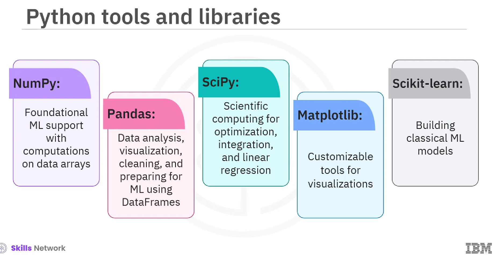

### Scikit-learn Machine learning Ecosystem

### Scikit-learn
What it is?
Scikit-learn is a free ML library for Python which is a wide up-to-date selection for classification, regression, clustering, and dimensionality reduction algorithms, and designed to work with NumPy and SciPy

What are implemented in Scikit-learn:
- Data preprocessing tasks
- Train or test splitting
- Model setup and fitting
- Hyperparameter tuning with cross-validation
- Prediction
- Evaluation
- Exporting the model to be used in production

#### Basic Machine Learning Workflow used in Scikit-learn library

