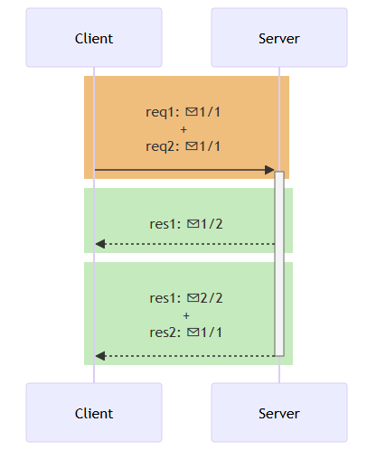

### WebSockets

- **Full-duplex communication**: is a communication mode in which both endpoints send and receive data simultaneously at the same time over the same connection --> full‑duplex offers continuous bi‑directional flow—like a natural telephone conversation
- **Hall-duplex communication**: is a communication mode in which transmissions happen one direction at a time or simplex (one-way-only)

**Definition**: A protocol providing a persistent, full-duplex communication channel between client and server ==over a single TCP connection==. WebSockets enable real-time features (like chat, live notifications, and collaborative editing) without repeatedly polling the server

- **Handshake Upgrade** - Starts as an HTTP request that “upgrades” the connection to WebSocket, negotiating a persistent TCP link.

- **Full-Duplex Messaging** - Once upgraded, both client and server can send text or binary messages independently at any time.

- **Connection Lifecycle** - You must handle connection open, message receipt, errors, and clean closure to avoid resource leaks.

### TCP/IP Model

==The TCP/IP model== is a **framework** that is used to model the communication in a network. It is mainly a collection of network protocols and organization of these protocols in different layers for modeling the network.

- It has four layers, Application, Transport, Network/Internet and Network Access.
- While the OSI model has seven layers, the 4 layer TCP/IP model is simpler and commonly used in today’s Internet and networking systems.

--> _Goal_: The role of TCP/IP is to make sure data sent by the sender arrives safely and correctly at the receiver's end. To do this, data before being sent it will be broken down into smaller parts called ==packets==, and these packets are sent separately and are reassembled in the correct order when they reach destination

#### Layers of TCP/IP Model

##### Application layer

The Application Layer is the top layer of the TCP/IP model and the one closest to the user. This is where all the apps you use like web browsers, email clients, or file sharing tools connect to the network. It acts like a bridge between your software (like Chrome, Gmail, or WhatsApp) and the lower layers of the network that actually send and receive data.

It supports different protocols like HTTP (for websites), FTP (for file transfers), SMTP (for emails), and DNS (for finding website addresses).

##### Transport layer

The Transport Layer is responsible for making sure that data is sent reliably and in the correct order between devices. It checks that the data you send like a message, file, or video arrives safely and completely. This layer uses two main protocols: TCP and UDP.

TCP is used when data must be correct and complete, like when loading a web page or downloading a file. It checks for errors, resends missing pieces, and keeps everything in order. On the other hand, UDP (User Datagram Protocol) is faster but doesn’t guarantee delivery useful for things like live video or online games where speed matters more than perfect accuracy.

##### Internet Layer

The Internet Layer is used for finding the best path for data to travel across different networks so it can reach the right destination. It works like a traffic controller, helping data packets move from one network to another until they reach the correct device. This layer uses the Internet Protocol (IP) to give every device a unique IP address, which helps identify where data should go.

##### Network Access Layer

The Network Access Layer is the bottom layer of the TCP/IP model. It deals with the actual physical connection between devices on the same local network like computers connected by cables or communicating through Wi-Fi.

#### How they work

**When Sending Data (From Sender to Receiver)**

- Application Layer: Prepares user data using protocols like HTTP, FTP, or SMTP.
- Transport Layer (TCP/UDP): Breaks data into segments and ensures reliable (TCP) or fast (UDP) delivery.
- Internet Layer (IP): Adds IP addresses and decides the best route for each packet.
- Link Layer (Network Access Layer): Converts packets into frames and sends them over the physical network.
  **When Receiving Data (At the Destination)**
- Link Layer: Receives bits from the network and rebuilds frames to pass to the next layer.
- Internet Layer: Checks the IP address, removes the IP header, and forwards data to the Transport Layer.
- Transport Layer: Reassembles segments, checks for errors, and ensures data is complete.
- Application Layer: Delivers the final data to the correct application (e.g., displays a web page in the browser).

---

### HTTP/1.1 vs HTTP/2 : Tại sao HTTP/2 lại nhanh hơn?

**HTTP (Hypertext Transfer Protocol)** là giao thức truyền tải tài nguyên cho Web theo mô hình Client-Server (hoặc Request-Response).

#### HTTP/1.1

HTTP/1.1 (version 1.1) phát hành vào năm 1999. ĐIểm nổi bật ở phiên bản này là hỗ trợ nhiều method hơn (GET, POST, PUT, DELETE, HEAD, OPTIONS và TRACE), có header. Hỗ trợ TCP Connection persistent connection(HTTP keep-alive) và HTTP Pipelining.

##### HTTP persistent connection (HTTP keep-alive)

Thay vì tạo mới TCP connection cho mỗi request và đóng sau khi nhận được response. Client sẽ tái sử dụng một TCP connection có sẵn cho nhiều HTTP request/response.

---

---

##### HTTP Pipelining

HTTP Pipelining cho phép Client gửi nhiều request liên tiếp mà không cần chờ response của request trước đó. Các request này sẽ được Server xử lý tuần tự, và response cũng sẽ được trả về theo đúng thứ tự request đã được gửi.
Tuy nhiên, nếu một request trong chuỗi gặp sự cố (ví dụ: mất gói tin, kết nối chậm), tất cả các request sau nó sẽ bị chặn (block) cho đến khi request bị lỗi được xử lý xong. Vấn đề này được gọi là Head-of-Line (HOL) blocking, là một hạn chế lớn của HTTP pipelining dựa trên TCP.
Để giải quyết các vấn đề của HTTP/1. SPDY (phát âm là "speedy") được tạo ra, SPDY ảnh hưởng đến việc thiết kế HTTP/2 sau này. Hãy tiếp tục để xem SPDY là gì và cách SPDY giải quyết các vấn đề của HTTP/1 như thế nào.

#### SPDY là gì?

SPDY giải quyết các vấn đề của HTTP/1

- **Head-of-line blocking**: Trong HTTP/1.1, nếu một request bị chậm hoặc lỗi, các request sau nó sẽ bị chặn. SPDY khắc phục bằng cách hỗ trợ multiplexing: nhiều request có thể được gửi song song qua cùng một TCP connection, mỗi request/response được gắn với một streamID. Vì vậy, một request bị lỗi sẽ không ảnh hưởng đến các request khác. Ở phần HTTP/2 sẽ giải thích rõ hơn về cách xử lý vấn đề này.
- **Overhead HTTP headers**: HTTP/1.1 gửi lại toàn bộ headers cho mỗi request, gây ra độ trễ không cần thiết. SPDY sử dụng nén header để giảm kích thước dữ liệu truyền tải, giúp cải thiện hiệu suất mạng.
- **Server Push**: Trong HTTP/1.1, Server chỉ phản hồi khi nhận được request từ client. SPDY bổ sung server push, cho phép Server chủ động gửi các tài nguyên mà nó đoán là Client sẽ cần, ví dụ như CSS, JavaScript, hình ảnh.

#### HTTP/2

HTTP/2 được phát triển dựa trên SPDY là phiên bản nâng cấp của HTTP/1 được thiết kế để cải thiện tốc độ và hiệu quả truyền dữ liệu trên web. Ra mắt vào năm 2015.

HTTP/2 sử dụng các kỹ thuật như ghép kênh (multiplexing), nén header, và đẩy dữ liệu từ Server (server push) để tối ưu hóa việc truyền tải dữ liệu.

##### Multiplexing

Multiplexing là tính năng quan trọng trong HTTP/2 giúp giải quyết vấn đề Head-of-Line (HOL) blocking ở tầng HTTP tồn tại trong HTTP/1.1.

Trong HTTP/1.1, dù sử dụng HTTP pipelining, các response vẫn phải được trả về theo thứ tự gửi request, dẫn đến tình trạng tắc nghẽn nếu một request gặp lỗi hoặc bị chậm.

HTTP/2 khắc phục vấn đề này bằng cách sử dụng các stream, mỗi stream tương ứng với một cặp request/response độc lập.

Mỗi stream sẽ được chia thành các frame. Mỗi frame chứa các thông tin về loại stream ID, loại frame và độ dài byte của frame đó. Các frame thuộc các stream khác nhau có thể được trộn lẫn và gửi đồng thời qua cùng một kết nối TCP.

Tuy nhiên, HTTP/2 chỉ giải quyết được HOL Blocking ở tầng HTTP. Nhưng vấn đề HOL Blocking vẫn còn ở tầng Transport do TCP bắt buộc đảm bảo thứ tự gói tin: nếu một gói bị mất, các gói sau phải chờ. Chỉ đến HTTP/3, khi TCP được thay bằng QUIC, vấn đề này mới được xử lý triệt để.

##### HTTP/2 truyền tải dữ liệu dạng nhị phân (Binary Protocol)

Khác với các phiên bản HTTP/1.x truyền dữ liệu dưới dạng văn bản (text), HTTP/2 sử dụng định dạng nhị phân để truyền tải.

##### Prioritization

Trong HTTP/2, Client có thể chỉ định mức độ ưu tiên (priority) cho từng request, giúp Server biết nên xử lý và phản hồi request nào trước dựa trên tầm quan trọng.

Tính năng này đặc biệt hữu ích khi tải một trang web phức tạp, nơi có nhiều tài nguyên được yêu cầu đồng thời.

Ví dụ về thứ tự ưu tiên từ cao đến thấp khi tải một trang web:
- HTML – cấu trúc chính của trang, nên tải đầu tiên.
- CSS / JavaScript – ảnh hưởng đến hiển thị và chức năng, cần được tải sớm.
- Font – cần cho việc hiển thị văn bản đúng định dạng.
- Image – thường không ảnh hưởng đến cấu trúc hoặc logic chính, có thể tải sau.

##### Header Compression
Các thông tin được truyền tải trên Web chứa nhiều header lặp đi lặp lại. HTTP/2 sử dụng HPACK compress (nén) các header này giúp giảm tải băng thông.

##### Server Push

Trong HTTP/2, Server Push là cơ chế cho phép Server chủ động gửi thêm các tài nguyên mà nó dự đoán Client sẽ cần, mà không cần chờ Client gửi request cho các tài nguyên đó.

Khi Client gửi một request (ví dụ: tải một trang HTML), Server có thể đồng thời "push" các tài nguyên liên quan như CSS, JavaScript, hoặc hình ảnh đi kèm. Điều này giúp giảm số lượng round-trip giữa Client và Server, từ đó tăng tốc độ tải trang.

---
