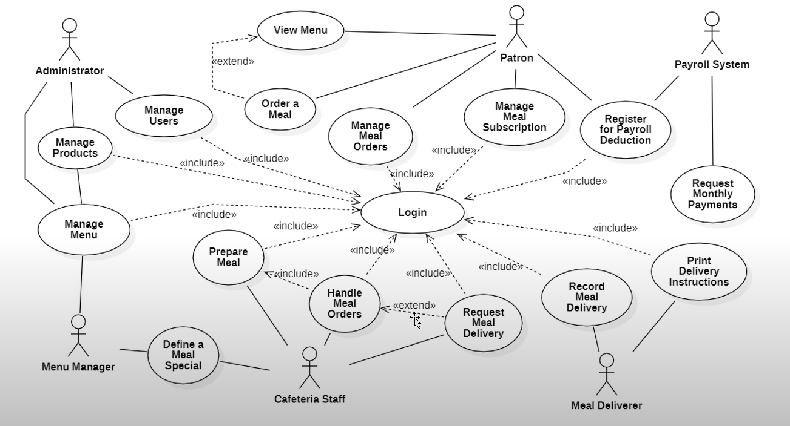
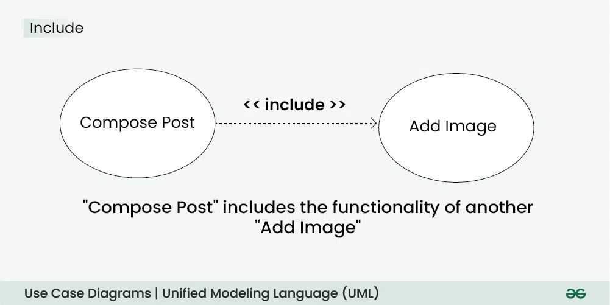
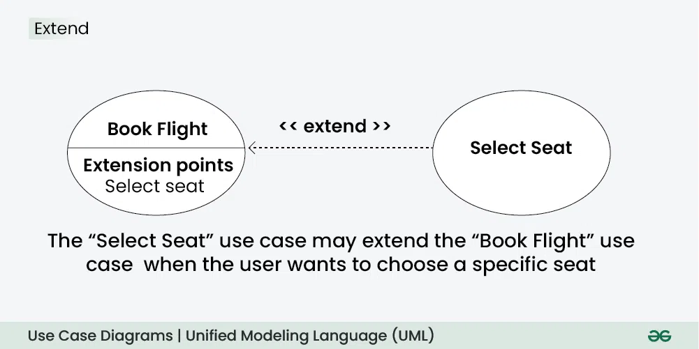
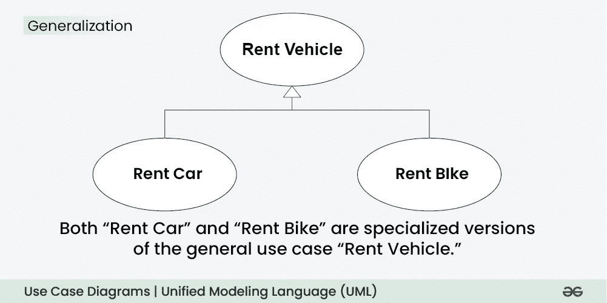
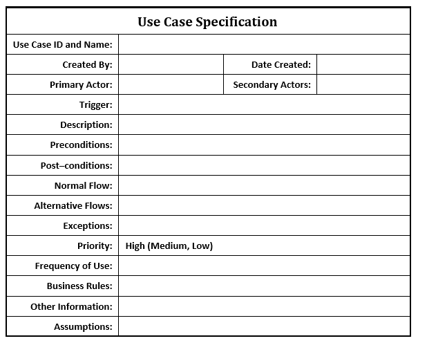

# NOTES ABOUT SOFTWARE REQUIREMENTs SPECIFICATION

## Types of Diagram 💖

### Context Diagram 🏀

**Định nghĩa**: Context Diagram là sự thể hiện sự tương tác giữa các actor (hình vuông) tương tác với hệ thống của chúng ta (hình tròn) thông qua các mũi tên thể hiện sự ra vào của dữ liệu (data must be a noun!!! ⛔)

---

### Use Case Diagram 🍄

**Định nghĩa**: Model the stakeholders of a system as well as the goals they want to achieve through interacting with the system.
Quy tắt đọc: khi nói đến mối quan hệ include or extend thì chúng ta sẽ có 1 thằng use case là ==base==

- Include: Ví dụ ta có ăn cơm (base)--include--> thanh toán. Thì ở mối quan hện này khi ăn cơm xảy ra thì thanh toán sẽ chắc chắn xảy ra không quan trọng thứ tự thực hiện, như ta có thể thanh toán tiền rồi ăn cơm hoặc là ăn cơm rồi mới thanh toán tiền. Trong trường hợp của include thì cái base là phía không có mũi tên
- Extend: Ví dụ ta có ăn cơm (base) <--extend-- ăn cơm thêm. Thì trong trường hợp này ăn cơm thêm có thể có hoặc không và mũi tên phải chỉ về hướng base use case.

**Use Case Diagram's Components**

- **Use Case** is a function that users can do to achieve something in the system
- **Association** is a interaction with use case, like who uses what functions or use cases
- **Actor**: roles --> can be draw with rectangle
- **System** defines the system boundary
- **Include** relates to the included use case to indicate inserted behavior
- **Extend** is a relationship between two use cases in which one is a variation of another

Use case diagram symbols and notation

- **Use cases**: Horizontally shaped ovals that represent the different uses that a user might have.
- **Actors**: Stick figures that represent the people actually employing the use cases.
- **Associations**: A line between actors and use cases.
- **System boundary boxes**: A box that sets a system scope to use cases. All use cases outside the box would be considered outside the scope of that system.
- **Include Relationship**: The Include Relationship indicates that a use case includes the functionality of another use case.
  
- **Extend Relationship**: illustrates that a use case can be extended by another use case under specific conditions.
  
- **Generalization Relationship**: The Generalization Relationship establishes an "is-a" connection between two use cases, indicating that one use case is a specialized version of another.
  

---

### Entity relationship diagrams (ERD)

ERD helps us understand the connection between various "entities" that make up a system.
ERD's Components

- Entity
- Attributes

**Relationship Between Entities in ERDs**

- Zero 
- One 
- Many 
- Zero or Many 
- One or Many 
- One and only one 

## Use Case Specification

**Trigger**
Trigger identifies the conditions, or events that initiate the use case. Think of it as the opening scene of your story - what happens in the real world that makes someone decide they need to use your system?

- Triggers can be ==time-based==, for ex the registration deadline approaches
- Triggers can be ==event-based==, for ex a student submits a grade appeal
- Triggers can be ==need-based==, for ex the department head receives notice that a new course has been approve

**Description**
Description briefly explains what the use case accomplishes from a business perspective. Write it as if you're explaining to a non-technical stakeholder why this functionality matters.

**Pre-conditions**
Preconditions define the state that must exist before the use case can begin successfully. Think of them as the prerequisite conditions that create a foundation for the interaction.
- ==User-related preconditions== ensure the right person is attempting the right action, for ex authentication, authorization
- ==System-related preconditions== ensure the technology infrastructure is ready, for ex the system must be operational, the database must be accessible, and any required external systems must be available
- ==Data-related preconditions== ensure the necessary information exists

**Post-conditions**
Post-conditions describe how the world has changed after the use case completes, whether successfully or unsuccessfully. Think of them as the "after" state that you could observe and verify.
- ==Successful completion==, identify what new information exists in the system, what relationships have been established or modified, and what new capabilities are now available to users. 
- ==Failure scenarios==, consider what partial changes might have occurred and what cleanup might be necessary. 

**Normal Flow**
The step-by-step description of how the interaction unfolds when everything goes smoothly.
- Start with the user's initial action and then alternate between user actions and system responses. Each step should be concrete and observable - something you could test or demonstrate. Avoid internal system details that the user can't see, and focus on the externally visible behavior that creates value.
- The scenario should follow a natural rhythm of interaction. Users need time to read information, make decisions, and enter data. Systems need time to process requests, validate information, and prepare responses. 
- Consider the cognitive load on the user at each step. Are you asking them to provide information they naturally have available? Are you giving them feedback at appropriate moments? Are you breaking complex tasks into manageable chunks? The main scenario should feel intuitive to someone actually performing the work.

**Alternative flow**
Alternative flows handle the complications that arise when the ideal scenario encounters real-world messiness. 
- Think systematically about what could vary at each step of the main scenario. Users might enter invalid data, make different choices, or change their minds. Systems might detect business rule violations, encounter performance issues, or lose connectivity to external services.
- For each alternative flow, specify where it branches from the main scenario, what triggers the alternative path, how the system responds, and where the flow either rejoins the main path or exits the use case entirely.

**Exceptions**
While alternative flows handle variations in the normal process, exceptions represent truly disruptive conditions that can occur at any point during the use case execution.

**Priority**
Priority reflects the relative importance of this use case within your overall system development effort. 

**Frequency of Use**
This section captures how often you expect this use case to be executed, which has profound implications for system design, performance requirements, and user interface considerations. 
- High frequency
- Medium frequency
- Low frequency

**Business Rules**
Business rules represent the policies, regulations, constraints, and logical conditions that your system must enforce.
- Business rules can be ==constraining==, like "Exam slots cannot overlap in the same room" or "Students cannot check into an exam more than 30 minutes before the scheduled start time."
- They can be ==derivational==, like "Total exam duration equals scheduled end time minus scheduled start time" or "Exam capacity equals room capacity minus 10% buffer for accessibility needs."

**Other Information**
This catch-all section captures important information that doesn't fit neatly into other categories but still influences how the use case should be implemented or understood

**Assumptions**
Assumptions represent the conditions or facts that you're taking for granted when writing the use case. These are the things you believe to be true but haven't explicitly verified or that represent decisions made elsewhere in the project that affect this particular use case.

