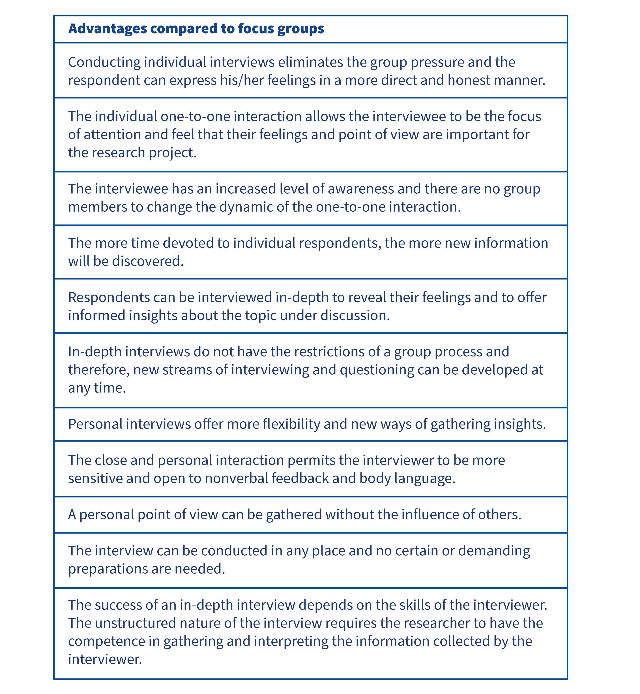
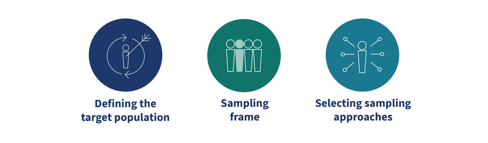

## Qualitative Research Approach

**Qualitative research** is a type of research that explores phenomena in their natural settings. Researchers try to understand and interpret things based on the meanings people bring to them. This approach involves collecting various forms of data, such as field notes, interviews, conversations, and recordings, to create a detailed picture of the world.

#### Key Characteristics of Qualitative Research
- **Natural Setting**: Data is collected in the natural environment where the issue or problem is experienced. 
- **Multiple Sources of Data**: Qualitative researchers use different methods to collect data, like interviews, observations, and documents. 
- **Key Informant Meanings**: This characteristic emphasizes that the researcher must stay true to what the participants mean and intend. The researcher's own interpretations should not override the meanings expressed by the people being studied.
- **Emergent Design**: The research plan isn't fixed from the start. It is flexible and can adapt as the study progresses.
- **Interpretive Inquiry**: Researchers interpret what they see, hear, and understand. Because of this, multiple viewpoints on the same problem can emerge, as readers, participants, and researchers all form their own interpretations.
- **Holistic View**: Qualitative researchers aim to create a complete and complex picture of the issue they are studying. This involves reporting on multiple perspectives, identifying different factors in a situation, and looking at the research problem from a broader point of view.

#### Crafting a Qualitative Study
The workflow goes like this: 
- Researchers begin their research with an issue or problem
- Investigate relevant empirical evidence and literature to identify relevant research evidence
- Collect Data and Analyze them

==*NOTE*:==
- The design of a qualitative study begins with broad assumptions regarding the qualitative inquiry and the theoretical lens, which shape and direct the study. 
- The researcher should define the theoretical domain of the study and the concepts which they wish to focus on
- The qualitative researcher should ask open-ended questions with the objective of initially adjusting them to the research context. 
- Feedback from the research participants should be used to shape the questions which will be used to collect the qualitative data and explore key informant insights.
- Qualitative research focuses on the extensive collection of data using several sources of information.

### Qualitative Data Collection 

#### Approach 1

##### Focus Group

**Definition**: A focus group is a qualitative research method where a small group of ==8 to 12 participants== engages in an in-depth discussion about a specific topic. The discussion is coordinated by a moderator. The key to a focus group's success is its interactive nature and the dynamics among the group members.

**Key Aspects and Characteristics**
- **Group Dynamics**: The interaction within the group is crucial. Unlike one-on-one interviews, a person's response can trigger new ideas and reflections from others. This interplay of responses often produces more information than if each participant were interviewed independently.

- **Discussion-based Approach**: The format avoids direct, rigid questions. Instead, it encourages free, flexible, and spontaneous discussion, making it a rich source of information.

- **Purpose and Use**: Focus groups are a method for collecting data in qualitative research. They are widely used by consumer goods companies to understand consumer behavior and opinions.

- **Recruitment**: Participants are recruited based on specific criteria. Recruiters try to avoid professional or "repeat" respondents who might not provide genuine opinions and may behave like actors.

- **Duration**: A typical focus group session lasts about one and a half hours. The first 10 minutes are for introductions, and the moderator uses about 20 minutes to explain the process and manage the discussion. The remaining time is for the participants to interact.

- **Motivation for Participation**: People participate in focus groups for various reasons, including a genuine interest in the topic, having knowledge about it, curiosity, or wanting to express their viewpoints. While some may participate for monetary compensation, the video notes that these individuals are often less committed to the objective of the group.

##### Personal in-depth Interviews
Personal ==in-depth interviews are unstructured interviews that take place through one-to-one interactions==. The interviewer should be trained to elicit in-depth and comprehensive answers to each of the questions. In-depth interviews can reveal hidden motivations and are considered one of the most popular data collection approaches in qualitative research. The in-depth interview is guided by the responses of the interviewee. As the interview progresses, the interviewer probes each answer and uses the answers for further questioning. 

#### Approach 2

##### Ethnography (Dân tộc học / Nghiên cứu dân tộc học)
Ethnography is a popular qualitative research method used in market research to understand consumers. Its main goal is to provide a rich, detailed description of a topic by ==observing and learning about people's lives and behaviors.==
**Key Aspects and Characteristics**
- **Focus on Consumer Behavior**: Ethnographic research helps brands learn about their consumers by offering insights into their behaviors, habits, and attitudes.

- **Data Collection**: The primary methods of data collection in ethnography are ==participant observation and qualitative interviews==. Researchers observe the daily lives of participants over an extended period. This provides deep insights into how people interact with products or services in their natural environments.

- **Creating a "Customer Persona"**: Companies use ethnographic research to create a "customer persona," ==which is a fictional representation of their ideal customer==. This persona is built on real data about the target audience's attributes, needs, habits, and wants. This information helps companies better design, position, and market their products.

- **Observational and Non-disruptive**: A key feature of ethnographic research is that it allows researchers to observe how a new product or service could be integrated into people's daily lives in a non-disruptive, informal way. Researchers often visit people in their homes or workplaces to see them in their natural surroundings.

- **Revealing Hidden Behaviors**: By observing for a long time, ethnography can reveal habits, behaviors, and attitudes that people might not even be aware of themselves or might not articulate in a direct interview.

- **Broad to Narrow Focus**: An ethnographic study typically starts broad and becomes more focused as the research progresses. This requires significant time and experience from the researcher to identify key concepts to focus on.

- **Application in Market Research**: Ethnographic research can reveal gaps in the market and help companies improve and refine their products or services.

- **Example**: The video provides an example of Panasonic's use of ethnography. The company observed the grooming behaviors of women in the USA. This research gave them insights into the colors and designs their customers preferred, leading to the development of the "Lady Shaver," a product that successfully stood out from competitors.

### Qualitative Research: Experiments and Surveys

#### Experimental study
==Quantitative research (nghiên cứu định lượng)== → tập trung vào ==experimental research (nghiên cứu thực nghiệm).==
Thí nghiệm = nhà nghiên cứu can thiệp bằng cách thay đổi (manipulate) biến độc lập (independent variable) để xem có ảnh hưởng gì đến biến phụ thuộc (dependent variable).
- Mối quan hệ nhân quả: biến độc lập (nguyên nhân) → biến phụ thuộc (kết quả).
- Một thí nghiệm tốt cần:
- Xác định rõ biến cần đo.
- Đảm bảo đo lường phù hợp.
- Giữ điều kiện thí nghiệm đồng nhất (hướng dẫn, phòng, thời gian, tương tác với đối tượng).

Ví dụ thị trường: một hãng giày muốn thử sản phẩm mới. Chủ cửa hàng lo ngại sản phẩm mới sẽ lấy mất doanh số từ dòng giày cũ. → Thực hiện thí nghiệm: chọn một số cửa hàng đại diện, bán thử dòng mới trong 6 tuần, so sánh doanh thu trước và sau. → Kết quả sẽ cho thấy sản phẩm mới có tạo thêm doanh thu hay chỉ chia sẻ doanh số từ dòng cũ.

#### Survey Methodology
Survey approaches are based on the design and development of well-structured ==questionnaires==.
- Key informants may be asked several questions about their intentions, motivations, attitudes, demographic and lifestyle characteristics among others.
- ==Structure== refers to the level of standardisation used during the data collection procedure. In structured data collection, a formal research instrument is developed and the different questions are offered in a pre-arranged order.

The research can be classified as **direct or indirect** based on whether the objective of the research is known to the respondents. In a survey questionnaire, the vast majority of questions are fixed responses that require the respondent to select the answer from a prearranged set of responses.

### Sampling Design Process
#### Cencus Vs Sample
Mục tiêu của nghiên cứu thị trường là cung cấp thông tin về đặc điểm của một dân số (population) – tức nhóm người có chung đặc điểm liên quan đến sản phẩm/dịch vụ.
**Population parameters**: Các con số mô tả toàn bộ dân số, ví dụ tỷ lệ khách hàng hài lòng với một thương hiệu.

Để thu thập dữ liệu, có hai cách:
- **Census (tổng điều tra)**: Thu thập thông tin từ toàn bộ dân số.
- **Sample (mẫu)**: Thu thập thông tin từ một phần dân số, rồi dùng thống kê để suy ra đặc điểm của cả population.

Điều quan trọng: Mẫu phải đại diện cho dân số (các nhóm người phải có tỷ lệ giống như trong dân số thật).

**Định lý Glivenko-Cantelli**: Khi lấy mẫu ngẫu nhiên với kích thước đủ lớn, mẫu sẽ phản ánh đúng phân phối của cả dân số.

Census thường quá tốn kém và mất thời gian (nhất là khi population rất lớn), trong khi sampling vừa tiết kiệm chi phí vừa hiệu quả.

#### The Sampling Design Process: Target Population, Sampling Frame, Sampling Techniques

The ==sampling design procedure==:
- Target population
- Sampling frame
- Selecting sampling approaches
- Sampling process
- Sampling process
- Non-response issues in sampling

>**Target population** should be specified in terms of elements, sampling units, extent and time. 

🔹Element = đối tượng mà bạn trực tiếp thu thập thông tin.
- Trong survey → element thường là 1 người trả lời (respondent).
🔹 Sampling Unit
- Sampling unit = đơn vị mà bạn thực sự chọn trong quá trình lấy mẫu.
- Có thể trùng với element, hoặc không.
    - Nếu bạn chọn trực tiếp từng người phụ nữ ≥30 tuổi → unit = element.
    - Nếu bạn chọn hộ gia đình trước, rồi phỏng vấn tất cả phụ nữ ≥30 trong hộ đó → unit = household, element = từng người phụ nữ.

>**Sampling Frame**
- Là danh sách/khung đại diện cho population.
- Ví dụ: danh sách khách hàng trong database, mailing list, số điện thoại random.
- Nguy cơ: Sampling frame error → khung không phản ánh chính xác population.
    - Có thể bao gồm sai đối tượng (ví dụ trong database có cả đàn ông khi bạn chỉ cần phụ nữ).
    - Có thể bỏ sót đối tượng (ví dụ thiếu khách hàng không có trong database).
- Để giảm lỗi → dùng screening questions khi thu thập dữ liệu.

>**Sampling Approaches (cách lấy mẫu)**

**🔹 Bayesian Sampling**
- Lấy mẫu tuần tự → mỗi lần chọn 1 element, thu thập dữ liệu, tính toán thống kê, sau đó mới chọn tiếp.
- Ưu điểm: tận dụng thông tin đã có để quyết định chọn mẫu tiếp theo.
- Mang tính linh hoạt & cập nhật liên tục, nhưng khá phức tạp.

**🔹 Sampling With / Without Replacement**
- With replacement: chọn một phần tử → thu thập dữ liệu → đưa trở lại khung → có thể chọn lại người đó lần sau.
- Without replacement: chọn một phần tử → thu thập dữ liệu → loại ra khỏi khung → không thể chọn lại.
- Trong survey thực tế → hầu hết là without replacement (vì không thể hỏi một người nhiều lần).

**🔹 Probability vs Non-probability Sampling**
- Probability sampling: dựa trên xác suất ngẫu nhiên → mỗi phần tử trong population đều có cơ hội được chọn.
- Non-probability sampling: dựa vào quyết định chủ quan của researcher (ví dụ chọn mẫu thuận tiện, snowball sampling).

>**Sampling process (quy trình lấy mẫu)**
- Là bước chuyển từ thiết kế lý thuyết sang thực tế.
- Phải định nghĩa chi tiết đơn vị lấy mẫu (sampling unit).

>**Sample validation (xác thực mẫu)**
- Sau khi có dữ liệu mẫu, cần kiểm chứng mẫu có đại diện cho dân số mục tiêu hay không.
- Cách làm: so sánh đặc điểm của mẫu (statistics) với đặc điểm của dân số (parameters).
- Nếu mẫu chưa cân bằng, có thể dùng ==weighting (trọng số)==:
    - Gán giá trị lớn hơn cho nhóm cần đại diện mạnh hơn.
    - Ví dụ: khảo sát dịch vụ, muốn nghe nhiều ý kiến từ khách hàng nặng ký (heavy users) → gán họ trọng số 3.0, khách dùng ít gán 1.0.

> **Non-response issues (vấn đề không phản hồi)**
- Khi người được chọn không trả lời (non-response) → gây ra bias vì mẫu không còn đại diện cho toàn bộ dân số.
- Giải pháp:
    - Tăng tỷ lệ phản hồi bằng: quà tặng, khảo sát ngắn gọn, follow-up reminders.
    - Nhưng: tăng số người trả lời không chắc giảm được bias, nếu những người bổ sung vẫn khác xa nhóm “không trả lời” còn lại.

### Sampling Techniques: Probability Sampling
#### Probability Sampling
**Nguyên tắc**: chọn ngẫu nhiên từ dân số.
Ví dụ: nếu có 100 khách hàng, thì mỗi khách hàng có xác suất 1/100 được chọn.
**Ưu điểm:**:
- Ít thiên lệch (unbiased).
- Có thể tính toán sai số lấy mẫu (sampling error).
- Dễ dàng khái quát kết quả ra toàn bộ dân số.

**Nhược điểm:**
- Tốn thời gian, chi phí, nguồn lực.
- Yêu cầu có danh sách đầy đủ dân số (sampling frame).

#### Types of Probability Sampling
**1. Simple Random Sampling (Lấy mẫu ngẫu nhiên đơn giản)**
- Nguyên tắc: mọi phần tử đều có cơ hội bằng nhau để được chọn.
- Cách làm: gán số cho tất cả phần tử → chọn bằng bảng số ngẫu nhiên / phần mềm random.
- Ví dụ: có 8000 khách hàng, muốn khảo sát 400 người → mỗi khách hàng có xác suất 400/8000 = 5% được chọn.
✅ Ưu điểm: công bằng, dễ hiểu.
❌ Nhược điểm: khó làm với dân số quá lớn nếu không có danh sách đầy đủ.

**2. Systematic Sampling (Lấy mẫu hệ thống)**
- Nguyên tắc: chọn theo khoảng cách (skip interval).
- Cách làm:
    - Gán số cho toàn bộ dân số.
    - Tính skip interval = Population size / Sample size.
    - Chọn 1 điểm bắt đầu ngẫu nhiên → sau đó lấy mỗi “khoảng cách k”.
- Ví dụ: dân số 10.000, mẫu 200 → skip interval = 50 → chọn mỗi khách hàng thứ 50.
✅ Ưu điểm: nhanh hơn random sampling, dễ thực hiện.
❌ Nhược điểm: có nguy cơ thiên lệch nếu dữ liệu sắp xếp theo một quy luật (ví dụ: khách hàng theo vùng địa lý).

**3. Stratified Sampling (Lấy mẫu phân tầng)**
- Nguyên tắc: chia dân số thành các tầng (strata) theo đặc điểm quan trọng → sau đó chọn mẫu ngẫu nhiên từ mỗi tầng.
- Ví dụ: khảo sát sinh viên → chia thành Nam / Nữ → chọn ngẫu nhiên từ mỗi nhóm để đảm bảo cả 2 giới đều được đại diện.
✅ Ưu điểm: đại diện tốt cho các nhóm quan trọng trong dân số.
❌ Nhược điểm: tốn thời gian vì phải phân loại dân số trước.

**4. Cluster Sampling (Lấy mẫu cụm)**
- Nguyên tắc: chia dân số thành các cụm (cluster) có sự đa dạng bên trong → chọn một số cụm ngẫu nhiên thay vì chọn từ tất cả.
- Ví dụ: khảo sát học sinh trên toàn quốc → chia theo trường học (mỗi trường là một cluster). Sau đó chọn ngẫu nhiên 10 trường để khảo sát.
- Có 2 dạng:
    - One-stage cluster: lấy toàn bộ phần tử trong cluster.
    - Two-stage cluster: lấy ngẫu nhiên một số phần tử trong cluster.
✅ Ưu điểm: tiết kiệm chi phí, phù hợp khi dân số quá lớn.
❌ Nhược điểm: ít chính xác hơn stratified vì không lấy từ tất cả các nhóm.

### Sampling Techniques: Non Probability Sampling
#### Non-Probability Sampling
**Nguyên tắc**: chọn mẫu dựa trên quan sát hoặc phán đoán (chứ không phải ngẫu nhiên).

Ví dụ: khảo sát khách quen trong cửa hàng, chọn người dễ tiếp cận.
**Ưu điểm:**
- Nhanh, rẻ, phù hợp khi ngân sách và thời gian hạn chế.
- Hữu ích trong nghiên cứu khám phá (exploratory research), pilot study (thử nghiệm nhỏ trước khi làm nghiên cứu lớn).

**Nhược điểm:**
- Có thiên lệch (bias).
- Không thể chắc chắn khái quát cho toàn bộ dân số.

#### Types of Probability Sampling
**1. Convenience Sampling (Lấy mẫu thuận tiện)**
Ý tưởng:
-Nhà nghiên cứu chọn những đối tượng dễ tiếp cận, sẵn có, ở đúng chỗ - đúng lúc.
Ví dụ:
- Phỏng vấn khách hàng đi siêu thị.
- Phỏng vấn người trên đường mà không cần kiểm tra tiêu chuẩn tham gia.
- Gửi survey qua email hoặc mời khách hàng tham gia khảo sát online.

**2. Judgmental Sampling (Lấy mẫu phán đoán / chọn mẫu theo chuyên gia)**
Ý tưởng:
Nhà nghiên cứu chọn mẫu dựa trên phán đoán cá nhân, kinh nghiệm, chuyên môn về những ai có khả năng đại diện cho dân số.
Ví dụ:
- Khảo sát nhóm khách hàng mục tiêu để kiểm tra tiềm năng sản phẩm mới.
- Chọn người “sành sỏi” hoặc có kỳ vọng cao để test sản phẩm mới.

#### ==Quota sampling==
Quota sampling is considered a two-stage restricted judgemental sampling that is used extensively in street interviewing. 
- Quota Sampling = Judgmental Sampling + Kiểm soát theo hạn ngạch.
- Đây là một dạng non-probability sampling (phi xác suất).

*Giai đoạn 1: Xác định quota (hạn ngạch)*
- Nhà nghiên cứu xác định các thuộc tính kiểm soát (control attributes) quan trọng.
- Sau đó, phân bổ mẫu theo tỷ lệ của dân số thật.
- Ví dụ: nếu dân số có 56% nữ – 44% nam, thì trong mẫu 1000 → cần 560 nữ – 440 nam.
- Ý nghĩa: Đảm bảo cấu trúc mẫu phản ánh cấu trúc dân số ít nhất ở các đặc tính đã chọn (giới tính, tuổi, nghề nghiệp…).

*Giai đoạn 2: Chọn mẫu trong quota*
- Khi quota đã định xong, người thu thập dữ liệu tự do chọn ai phù hợp quota (bằng tiện lợi hoặc phán đoán).

- Ví dụ: một interviewer ngoài đường có quota cần phỏng vấn 10 phụ nữ tuổi 20–30 → họ có thể chọn bất kỳ ai họ gặp phù hợp, nhưng không theo xác suất ngẫu nhiên.

#### ==Snowball Sampling==
Là một phương pháp ==non-probability sampling (phi xác suất)==, còn gọi là chain-referral sampling. (lấy mẫu quả cầu tuyết / dây chuyền)
Bước 1:
- Nhà nghiên cứu tìm một nhóm ban đầu (initial participants).

Bước 2:
- Nhóm ban đầu giới thiệu thêm người phù hợp → những người này lại giới thiệu thêm người khác → số lượng tăng dần thành “quả cầu tuyết”.
##### Các loại Snowball Sampling
(a) Linear Snowball Sampling
- Mỗi người chỉ giới thiệu 1 người khác → tạo thành một chuỗi thẳng.
- Ưu: ít tốn thời gian.
- Nhược: nếu ai đó dừng lại, chuỗi bị ngắt → khó đạt cỡ mẫu mong muốn.

(b) Exponential Non-Discriminative Snowball Sampling
- Mỗi người có thể giới thiệu nhiều người (theo dạng cấp số nhân).
- Ưu: tăng số mẫu rất nhanh.
- Nhược: có thể đưa vào nhiều người không phù hợp (thiếu sàng lọc).

(c) Exponential Discriminative Snowball Sampling
- Cũng theo cấp số nhân, nhưng nhà nghiên cứu lọc kỹ trước khi chấp nhận người được giới thiệu.
- Ưu: đảm bảo chất lượng người tham gia.
- Nhược: tốn thời gian hơn vì phải sàng lọc.

### Sample Size And Non-response Issues
#### Sample Size
**Các yếu tố ảnh hưởng đến cỡ mẫu**
(a) Bản chất và bối cảnh nghiên cứu
- Nếu nghiên cứu khám phá (exploratory research, thường là định tính) → cần mẫu nhỏ, vì mục tiêu là hiểu sâu chứ không cần đại diện.
- Nếu nghiên cứu mô tả (descriptive research, thường định lượng) → cần mẫu lớn để đảm bảo độ tin cậy và có thể khái quát hóa.

(b) Số lượng biến (variables) hoặc chủ đề nghiên cứu
- Ví dụ: nghiên cứu về hành vi mua hàng, hình ảnh thương hiệu, mức độ hài lòng, truyền miệng điện tử (e-WOM) → càng nhiều biến → cần cỡ mẫu lớn để giảm sai số.

(c) Loại phân tích dự kiến
- Phân tích đơn giản (ví dụ thống kê mô tả) → có thể dùng mẫu nhỏ hơn.
- Phân tích phức tạp (ví dụ phân tích đa biến – multivariate analysis bằng SPSS, Stata…) → cần mẫu lớn để đảm bảo ý nghĩa thống kê.

(d) Nguồn lực và chi phí
- Mẫu lớn hơn = chi phí cao hơn (tuyển chọn, phỏng vấn, xử lý dữ liệu…).
- Nhà nghiên cứu phải cân đối giữa mong muốn (mẫu lớn, chính xác hơn) và khả năng thực tế (thời gian, tiền bạc, nhân lực).

(e) Tham khảo từ nghiên cứu trước
- Có thể xác định cỡ mẫu dựa trên những nghiên cứu tương tự đã thực hiện trước đó.

#### Non-response Issues
**Cách tăng Response Rate (tỷ lệ phản hồi)**
(a) Prior Notification (Thông báo trước)
Gửi thông báo trước cho người tham gia tiềm năng để họ biết về mục đích nghiên cứu, lợi ích, thời gian cần thiết.
Giúp tạo sự tin tưởng, làm người tham gia chuẩn bị sẵn tâm lý.

(b) Incentives (Khuyến khích/Phần thưởng)
Monetary incentives (tiền tệ): voucher, thẻ quà tặng, tiền mặt.
Prepaid = gửi kèm khi mời tham gia (tạo động lực ngay).
Promised = chỉ gửi khi người tham gia hoàn tất khảo sát.
Non-monetary incentives (phi tiền tệ): bút, sách, tài liệu nghiên cứu, hoặc kết quả khảo sát.

(c) Questionnaire Design (Thiết kế bảng hỏi)
Bảng hỏi nên:
Rõ ràng, dễ hiểu, tránh dài dòng.
Thân thiện, hấp dẫn để tạo trải nghiệm dễ chịu.
Nếu bảng hỏi gây khó chịu → tăng tỷ lệ từ chối.

(d) Administration (Quản lý thu thập dữ liệu)
Nhà nghiên cứu/điều tra viên cần được huấn luyện tốt, biết cách giao tiếp để thuyết phục người tham gia.

(e) Follow-Up (Nhắc nhở & Liên hệ lại)
Gửi lời nhắc qua email, tin nhắn hoặc gọi điện cho những người chưa trả lời.
Một số người ban đầu bận → follow-up giúp tăng tỷ lệ tham gia.

(f) Scheduling (Lên lịch hợp lý)
Ví dụ: người tiêu dùng thường rảnh vào cuối tuần hơn so với ngày thường.
Liên hệ vào thời điểm phù hợp giúp tăng khả năng có phản hồi.

### Secondary data
Secondary data là dữ liệu đã được thu thập trước đó (không phải do nghiên cứu hiện tại trực tiếp thu thập).

Có hai nguồn chính:
- Nguồn bên ngoài:
    - Cơ quan nhà nước, tổ chức, cá nhân công bố số liệu.
    - Ví dụ: xu hướng tiêu dùng, dữ liệu ngành, thống kê thị trường.
- Nguồn nội bộ (internal):
    - Xuất phát từ chính doanh nghiệp.
    - Ví dụ: báo cáo thường niên, dữ liệu bán hàng, hồ sơ khách hàng, hành vi mua sắm, tạp chí nội bộ.

### Internal Secondary data

