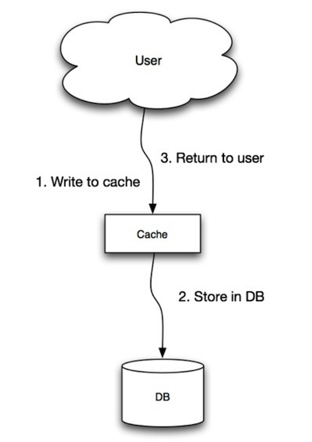
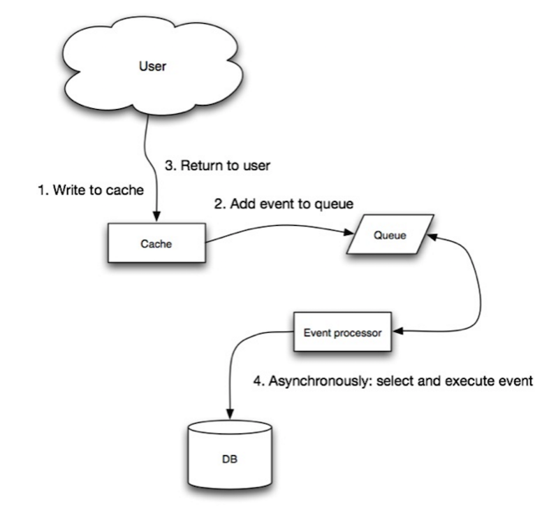

## Cache

There are multiple levels you can cache that fall into two general categories: **database queries** and **objects**:

### Caching at the database query level
Whenever you query the database, ==hash the query as a key and store the result to the cache==. This approach suffers from expiration issues:
- Hard to delete a cached result with complex queries **(1)**
- If one piece of data changes such as a table cell, you need to delete all cached queries that might include the changed cell
> **(1)** Why it is hard to delete a cached result with complex queries
> ==A cached result of query is deleted When the data that query looking for is changed==
Consider this example: 

```sql
SELECT * FROM users WHERE id = 123
```
This query depends on the id = 123. So when the users of this id changes something in database this query becomes invalid
For complex queries like 

```sql
SELECT u.name, p.title, COUNT(c.id) as comment_count
FROM users u
JOIN posts p ON u.id = p.author_id
JOIN comments c ON p.id = c.post_id
WHERE u.created_at > '2024-01-01'
  AND p.status = 'published'
GROUP BY u.id, p.id
HAVING comment_count > 5
ORDER BY comment_count DESC
```

The difficulty of figuring out when a query becomes invalid is 
- **Indirect dependencies**: A query might not directly reference a table but still depend on it through joins or subqueries.
- **Conditional Dependencies**: The query above only includes users created after 2024-01-01. If user 456 was created in 2023, changing their data shouldn't invalidate this cache - but if they were created in 2024, it should.
- **Aggregation Dependencies**: When a query uses COUNT, SUM, or GROUP BY, adding or removing any related record affects the result, even if that specific record wasn't in the original result set.

### Caching at the object level
See your data as an object, similar to what you do with your application code. Have your application assemble the dataset from the database into a class instance or a data structure(s):

- Remove the object from cache if its underlying data has changed
- Allows for asynchronous processing: workers assemble objects by consuming the latest cached object

Suggestions of what to cache:
- User sessions
- Fully rendered web pages
- Activity streams
- User graph data

### When to update the cache (Cache Strategies)

#### Cache-aside


The application is responsible for reading and writing from storage. The cache does not interact with storage directly. The application does the following:

- Look for entry in cache, resulting in a ==cache miss==
- Load entry from the database
- Add entry to cache
- Return entry

```python
def get_user(self, user_id):
    user = cache.get("user.{0}", user_id)
    if user is None:
        user = db.query("SELECT * FROM users WHERE user_id = {0}", user_id)
        if user is not None:
            key = "user.{0}".format(user_id)
            cache.set(key, json.dumps(user))
    return user
```

Subsequent reads of data added to cache are fast. Cache aside is also referred to ==lazy loading== because if the data has been asked so the data is loaded into cache. Only requested data is cached, which avoids filling up the cache with data that isn't requested.

> Memcached is generally used in this manner.

**Disadvantage(s): cache-aside**
- Each ==cache miss results in three trips==, which can cause a noticeable delay.
- Data can become stale if it is updated in the database. This issue is mitigated by setting a time-to-live (TTL) which forces an update of the cache entry, or by using write-through.
- When a node fails, it is replaced by a new, empty node, increasing latency.

#### Write-through 


The application uses the cache as the main data store, reading and writing data to it, while the cache is responsible for reading and writing to the database:
- Application adds/updates entry in cache
- Cache synchronously writes entry to data store
- Return

**Application code:**
```python
set_user(12345, {"foo":"bar"})
```
**Cache code:**
```python
def set_user(user_id, values):
    user = db.query("UPDATE Users WHERE id = {0}", user_id, values)
    cache.set(user_id, user)
```
Write-through is a slow overall operation due to the write operation, but subsequent reads of just written data are fast. Users are generally more tolerant of latency when updating data than reading data. Data in the cache is not stale.

**Disadvantage(s): write through**
- When a new node is created due to failure or scaling, the new node will not cache entries until the entry is updated in the database. Cache-aside in conjunction with write through can mitigate this issue.
- Most data written might never be read, which can be minimized with a TTL.

#### Write-behind (write-back)


In write-behind, the application does the following:

- Add/update entry in cache
- Asynchronously write entry to the data store, improving write performance

**Disadvantage(s): write-behind**
- There could be data loss if the cache goes down prior to its contents hitting the data store.
- It is more complex to implement write-behind than it is to implement cache-aside or write-through.

#### Refresh-ahead

You can configure the cache to ==automatically refresh any recently accessed cache entry prior to its expiration==.

Refresh-ahead can result in reduced latency vs read-through if the cache can accurately predict which items are likely to be needed in the future.
**Disadvantage(s): refresh-ahead**
- Not accurately predicting which items are likely to be needed in the future can result in reduced performance than without refresh-ahead.