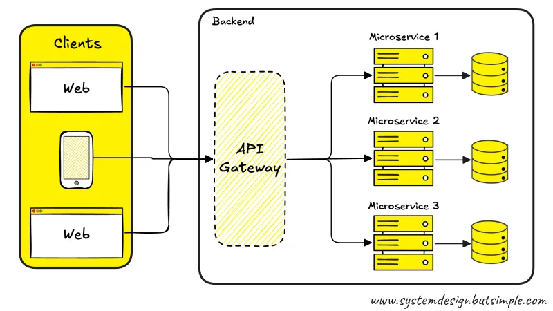
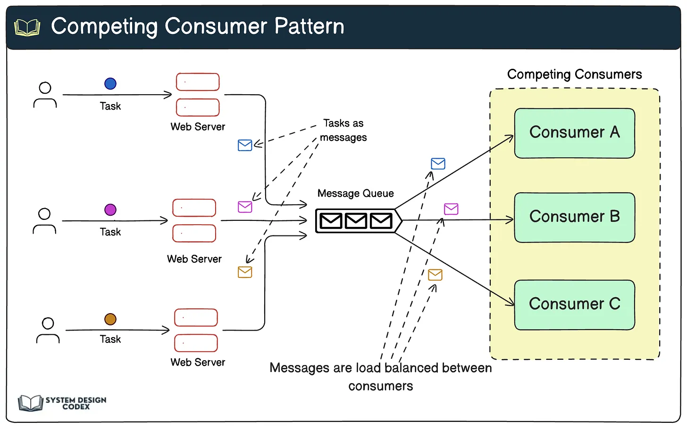
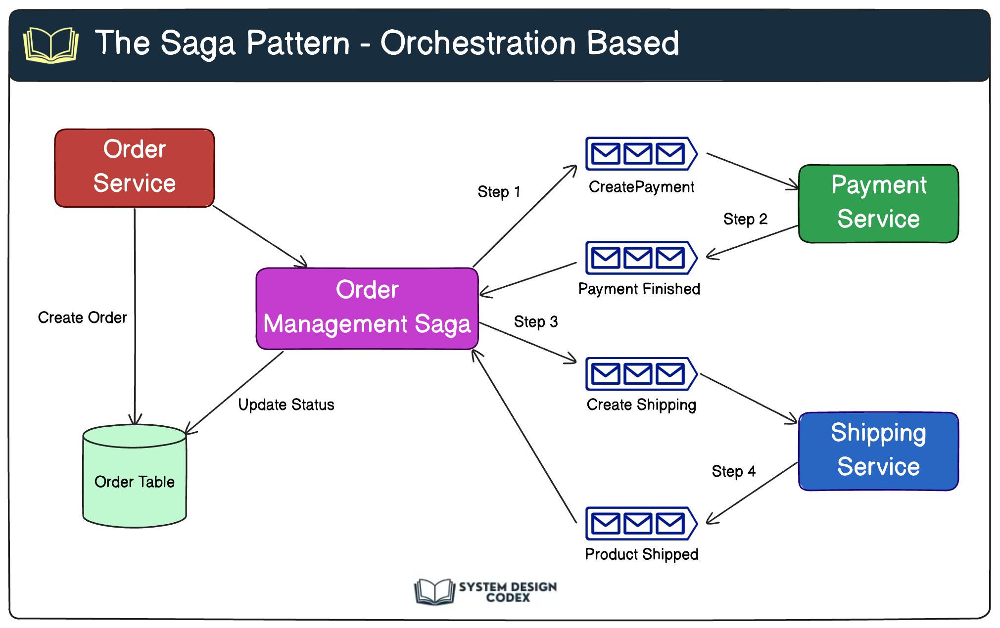

### API Gateway
A single entry point that handles and routes API requests to backend services.
Use it when you have multiple services and want to centralize access, authentication, logging, and request handling.

### Event-Driven Architectural Patterns

#### Competing Consumer Pattern

In this pattern,==multiple consumers listen to a shared event queue==, but ==only one== of them processes each message.

It helps you scale out the processing of heavy workloads. Each consumer competes to grab messages from the queue. If the workload spikes, you can add more consumers to handle the load faster.

**Real-world example:**
Imagine a video-processing service. Every time a user uploads a video, an event is pushed to a queue. Several consumer services (workers) pick up these jobs and process them in parallel—transcoding, thumbnail generation, etc.

**Things to watch out for:**

- Ensure idempotency of consumers (same message might get processed twice).

- Avoid race conditions by locking shared resources properly.

#### Asynchronous Task Execution Pattern
Sometimes tasks can't or shouldn't be executed immediately. The Async Task Execution pattern ==handles tasks asynchronously== and ensures ==retry logic in case of failure==.

**How it works:**

- The producer sends a task as an event to a message queue.

- A consumer picks it up and executes the task.

- If the task fails (e.g., due to a database error), it can be retried based on a retry policy or moved to a dead-letter queue.

#### Saga Pattern
The Saga pattern helps manage ==distributed transactions== across multiple services in an event-driven way.

Instead of using two-phase commit (2PC) (which is hard to scale), ==the Saga breaks the transaction into a series of local transactions==, coordinated using events.

**There are two common Saga approaches:**

**Choreography:** Services listen to events and respond accordingly.

**Orchestration:** A central service dictates the flow of the saga by emitting commands.

